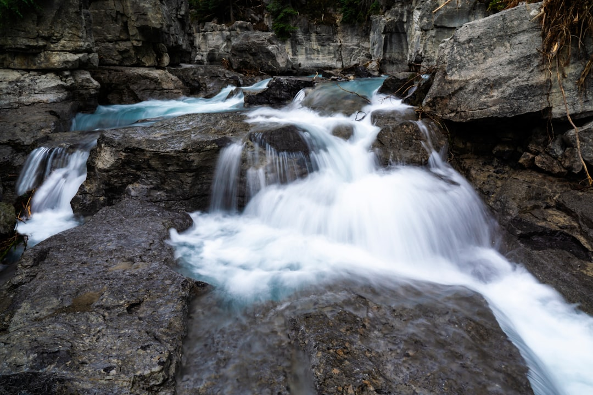

## 第68候 · Shimizu atataka wo fukumu

### "Springs thaw"

> January 10-14 · 小寒 Shōkan (Minor Cold)

**Why now?** Deep underground springs begin to warm slightly as geothermal heat persists even as surface freezes. Water emerges warmer than the air, steaming in cold mornings.

**Insight:** Springs flow from depths that surface cold can't reach. Deep sources continue when surfaces freeze. Your deepest resources may be more stable than your circumstances suggest.

**Today's practice:** Find warmth at the source. Go deeper when the surface freezes.

> **💬** "Before enlightenment; chop wood, carry water. After enlightenment; chop wood, carry water."
> — Zen Proverb

**Learn more:**

- [Natural Springs](https://en.wikipedia.org/wiki/Spring_(hydrology))
- [Onsen - Hot Springs](https://www.japan-guide.com/e/e2292.html)
