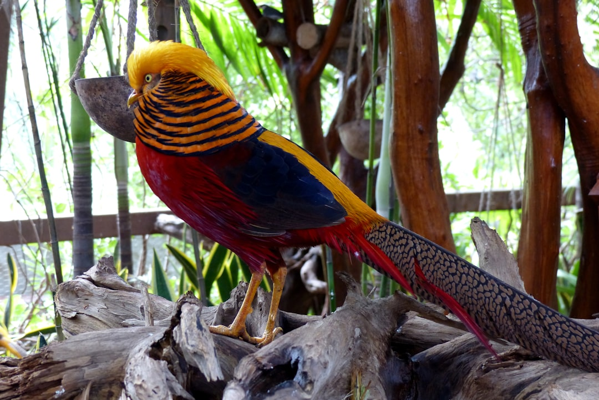

## 第69候 · Kiji hajimete naku

### "Pheasants start to call"

> January 15-19 · 小寒 Shōkan (Minor Cold)

**Why now?** Pheasants begin to call as days lengthen—their mating calls are among the first bird sounds to break winter's quiet. They sense the turn before it's visible.

**Insight:** The pheasant calls in response to lengthening light, not warming temperature. It reads the true signal, not the obvious one. Some changes are better detected through subtle indicators.

**Today's practice:** Notice lengthening days. What small change carries the important message?

> **💬** "Winter is the time for comfort, for good food and warmth, for the touch of a friendly hand and for a talk beside the fire."
> — Edith Sitwell

**Learn more:**

- [Green Pheasant](https://en.wikipedia.org/wiki/Green_pheasant)
- [Early Spring Sounds](https://www.japan-guide.com/e/e2012.html)
