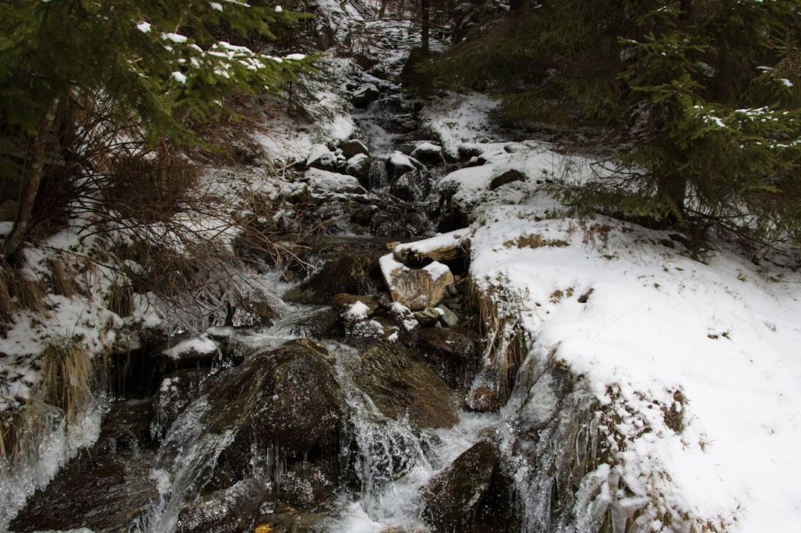

## 第71候 · Sawamizu kōri tsumeru

### "Ice thickens on streams"

> January 25-29 · 大寒 Daikan (Major Cold)

**Why now?** Ice reaches its maximum thickness on streams and ponds—the accumulation of cold nights over weeks. This is the depth of winter's grip.

**Insight:** Ice thickens through patient accumulation—each cold night adds a layer. Depth comes from persistence, not single events. The most solid structures build slowly.

**Today's practice:** Add a layer today to something you're building slowly. Depth takes time.

> **💬** "To appreciate the beauty of a snowflake it is necessary to stand out in the cold."
> — Aristotle

**Learn more:**

- [Ice Formation on Streams](https://en.wikipedia.org/wiki/Ice)
- [Daikan - Coldest Period](https://www.nippon.com/en/features/h00124/)
