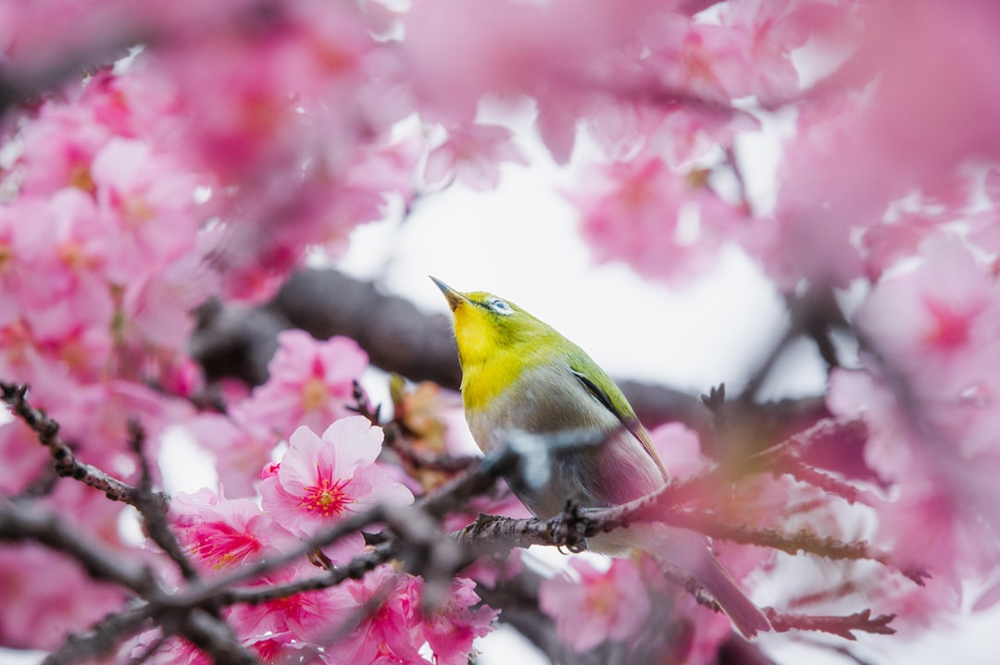

## 第2候 · Kōō kenkan su

### "Bush warblers start singing"

> February 9-13 · 立春 Risshun (Beginning of Spring)

**Why now?** The uguisu (bush warbler) begins its distinctive call—'ho-hokekyo'—as days lengthen. These birds have been silent all winter, but now they announce themselves. Their song is considered one of the first heralds of spring in Japan.

**Insight:** The warbler's song emerges not from nowhere, but from winter's silence. It practiced in the dark. When conditions shift, readiness meets opportunity. What appears as sudden expression is actually long preparation finally voiced.

**Today's practice:** Listen for birdsong today. When you hear it, pause and give it your full attention for ten seconds.

> **💬** "Instructions for living a life: Pay attention. Be astonished. Tell about it."
> — Mary Oliver

**Learn more:**

- [Japanese Bush Warbler](https://en.wikipedia.org/wiki/Japanese_bush_warbler)
- [Uguisu Song](https://www.japan-guide.com/e/e2012.html)
