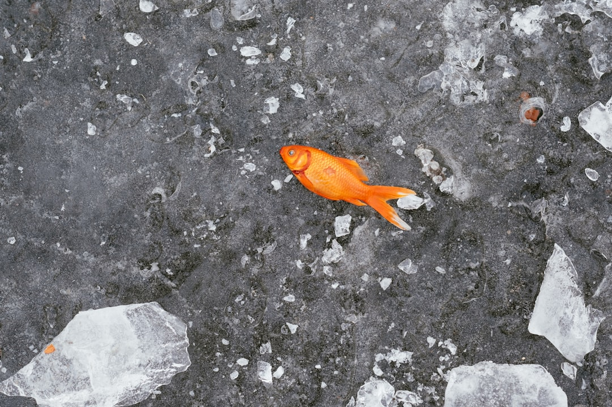

## 第3候 · Uo kōri wo izuru

### "Fish emerge from the ice"

> February 14-18 · 立春 Risshun (Beginning of Spring)

**Why now?** As ice thins, fish that sheltered in deeper, warmer water begin rising toward the surface. They emerge through gaps in the ice, drawn by increasing light and oxygen. Life moves upward, toward the sun.

**Insight:** The fish don't break through the ice—they find where it has already thinned. Emergence requires both readiness and finding the right opening. Sometimes patience means waiting for the gap, not forcing the breakthrough.

**Today's practice:** Surface something you've kept submerged—a thought, a project, a conversation that's ready to emerge.

> **💬** "No winter lasts forever; no spring skips its turn."
> — Hal Borland

**Learn more:**

- [Ice Fishing Japan](https://livejapan.com/en/article-a0000766/)
- [Fish Behavior Under Ice](https://en.wikipedia.org/wiki/Ice_fishing)
