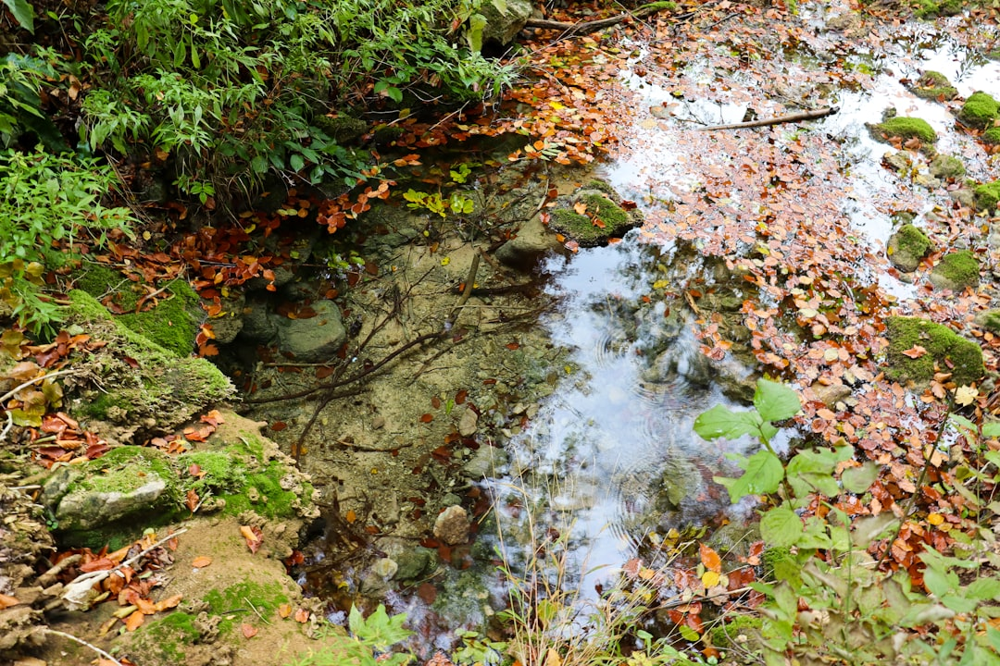

## 第4候 · Tsuchi no shō uruoi okoru

### "Rain moistens the soil"

> February 19-23 · 雨水 Usui (Rainwater)

**Why now?** Rain begins to fall on soil that can finally receive it. After months of frozen ground, the earth softens and becomes absorbent again. The same rain that would have run off now soaks in, feeding roots waiting below.

**Insight:** Reception requires preparation. The rain hasn't changed—the earth has. Sometimes what we need has been falling all along; we simply weren't ready to absorb it. Thawing precedes receiving.

**Today's practice:** Water something—a plant, a relationship, a project—that's ready to receive nourishment.

> **💬** "Adopt the pace of nature: her secret is patience."
> — Ralph Waldo Emerson

**Learn more:**

- [Spring Rain Japan](https://www.japan-guide.com/e/e2011.html)
- [Soil Thawing](https://en.wikipedia.org/wiki/Frost_heaving)
