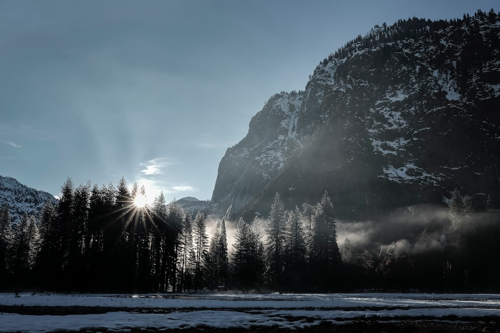

## 第5候 · Kasumi hajimete tanabiku

### "Mist starts to linger"

> February 24-28 · 雨水 Usui (Rainwater)

**Why now?** Mist lingers in valleys and low places, neither fully rain nor clear air. This transitional weather creates soft, diffuse light and blurred boundaries. The world becomes impressionistic, edges softened.

**Insight:** Mist is transition made visible—water caught between states. When we're between phases, clarity naturally decreases. This isn't failure of vision; it's the nature of crossing. Some passages require navigating without sharp edges.

**Today's practice:** Accept one area of uncertainty today without forcing clarity. Let the mist be.

> **💬** "The world is full of magic things, patiently waiting for our senses to grow sharper."
> — W.B. Yeats

**Learn more:**

- [Kasumi - Japanese Mist](https://en.wikipedia.org/wiki/Haze)
- [Spring Weather Patterns](https://www.jma.go.jp/jma/indexe.html)
