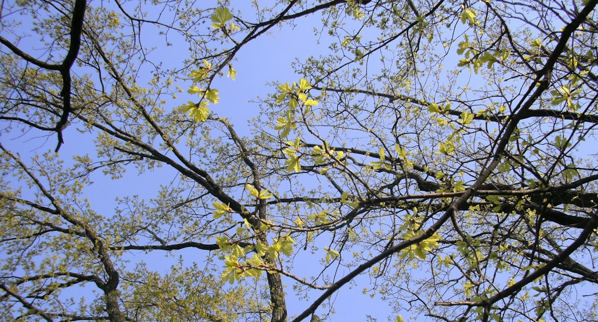

## 第6候 · Sōmoku mebae izuru

### "Grass sprouts, trees bud"

> March 1-5 · 雨水 Usui (Rainwater)

**Why now?** Dormant buds on trees and grasses begin to swell and open. Energy stored through winter now expresses as visible growth. What looked dead reveals it was only sleeping, gathering strength for this moment.

**Insight:** The bud was there all along, wrapped tight, waiting. Growth isn't created in spring—it's released. What emerges was already forming in the dark. Trust that your quiet seasons have been building something.

**Today's practice:** Notice signs of growth that aren't yet obvious to others. Acknowledge your hidden progress.

> **💬** "And the day came when the risk to remain tight in a bud was more painful than the risk it took to blossom."
> — Anaïs Nin

**Learn more:**

- [Tree Buds](https://en.wikipedia.org/wiki/Bud#Vegetative_budding)
- [Spring Growth](https://www.britannica.com/science/vernalization)
