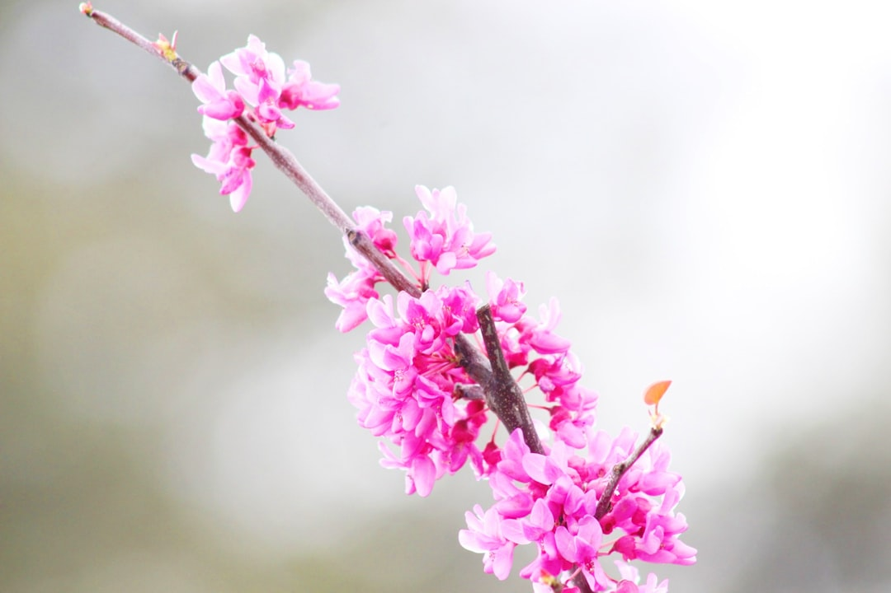

## 第7候 · Sugomori mushito wo hiraku

### "Hibernating insects surface"

> March 6-10 · 啓蟄 Keichitsu (Awakening of Insects)

**Why now?** Insects that entered diapause (a hibernation-like state) begin to stir as soil temperatures rise. They 'open their doors' and emerge into a changed world. The ground itself becomes active again.

**Insight:** The insects didn't die—they paused. Their emergence teaches that stillness isn't absence of life, but life in waiting mode. What surfaces in spring was alive all winter, just operating differently. Your dormant periods contain vitality.

**Today's practice:** Open a door you closed for protection. See what's changed while you were sheltered.

> **💬** "Between stimulus and response there is a space. In that space is our power to choose."
> — Viktor Frankl

**Learn more:**

- [Insect Dormancy](https://en.wikipedia.org/wiki/Diapause)
- [Keichitsu Explanation](https://www.nippon.com/en/japan-topics/b09704/)
