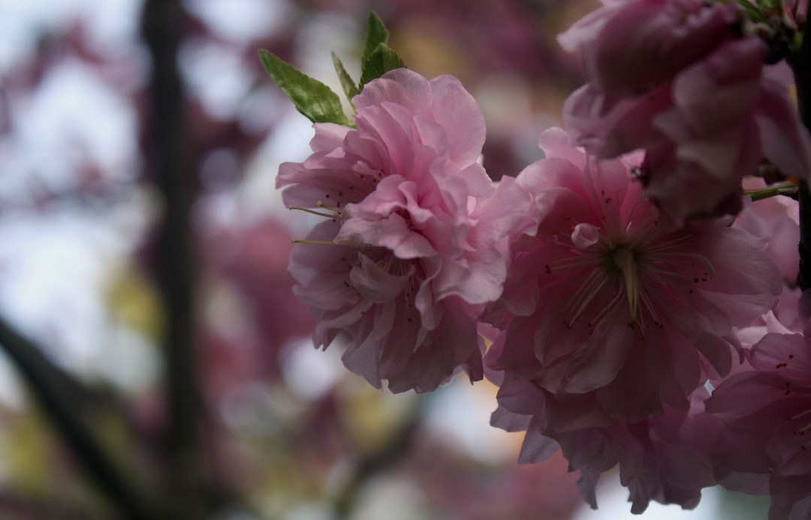

## 第8候 · Momo hajimete saku

### "First peach blossoms"

> March 11-15 · 啓蟄 Keichitsu (Awakening of Insects)

**Why now?** Peach trees bloom with pink flowers before their leaves appear—flowers first, foliage second. This burst of color against bare branches is striking, a celebration before the practical work of leaves.

**Insight:** The peach tree leads with beauty, not utility. It flowers before it can photosynthesize efficiently. Sometimes expression must precede function. Not everything useful looks practical at first.

**Today's practice:** Lead with expression before explanation. Let beauty precede justification.

> **💬** "The earth laughs in flowers."
> — Ralph Waldo Emerson

**Learn more:**

- [Peach Blossom Japan](https://www.japan-guide.com/e/e2012.html)
- [Flowering Before Leaves](https://en.wikipedia.org/wiki/Peach#Description)
