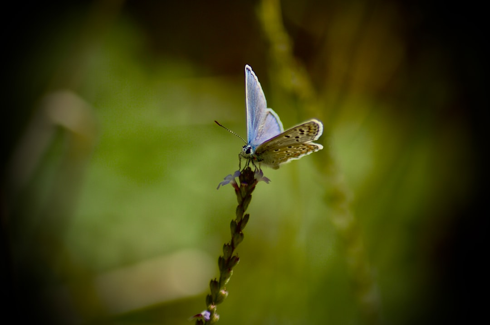

## 第9候 · Namushi chō to naru

### "Caterpillars become butterflies"

> March 16-20 · 啓蟄 Keichitsu (Awakening of Insects)

**Why now?** Caterpillars that pupated in autumn now emerge as butterflies. The transformation happened in darkness, unseen. What crawled now flies—same creature, completely changed form.

**Insight:** Metamorphosis isn't improvement; it's total reorganization. The caterpillar didn't become a better caterpillar—it became something else entirely. Some growth requires dissolution before reconstitution.

**Today's practice:** Identify one way you've transformed, not just improved. Honor the magnitude of change.

> **💬** "The expert in anything was once a beginner."
> — Helen Hayes

**Learn more:**

- [Butterfly Metamorphosis](https://en.wikipedia.org/wiki/Butterfly#Life_cycle)
- [Spring Butterflies Japan](https://www.japan-guide.com/e/e2012.html)
