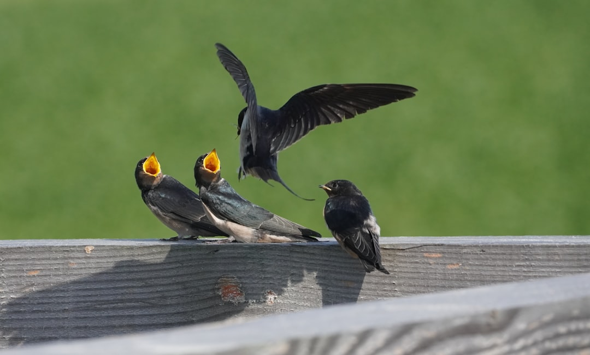

## 第13候 · Tsubame kitaru

### "Swallows return"

> April 5-9 · 清明 Seimei (Clear and Bright)

**Why now?** Barn swallows return from their southern wintering grounds, arriving in Japan to nest. These long-distance migrants navigate thousands of miles to return to familiar places.

**Insight:** Swallows return to where they know they can thrive. Migration isn't just leaving—it's knowing where to come back to. Home can be seasonal, returned to when conditions are right.

**Today's practice:** Welcome something or someone returning to your life. Make space for the arrival.

> **💬** "Do not go where the path may lead, go instead where there is no path and leave a trail."
> — Ralph Waldo Emerson

**Learn more:**

- [Barn Swallow Migration](https://en.wikipedia.org/wiki/Barn_swallow#Migration)
- [Qingming Festival](https://en.wikipedia.org/wiki/Qingming_Festival)
