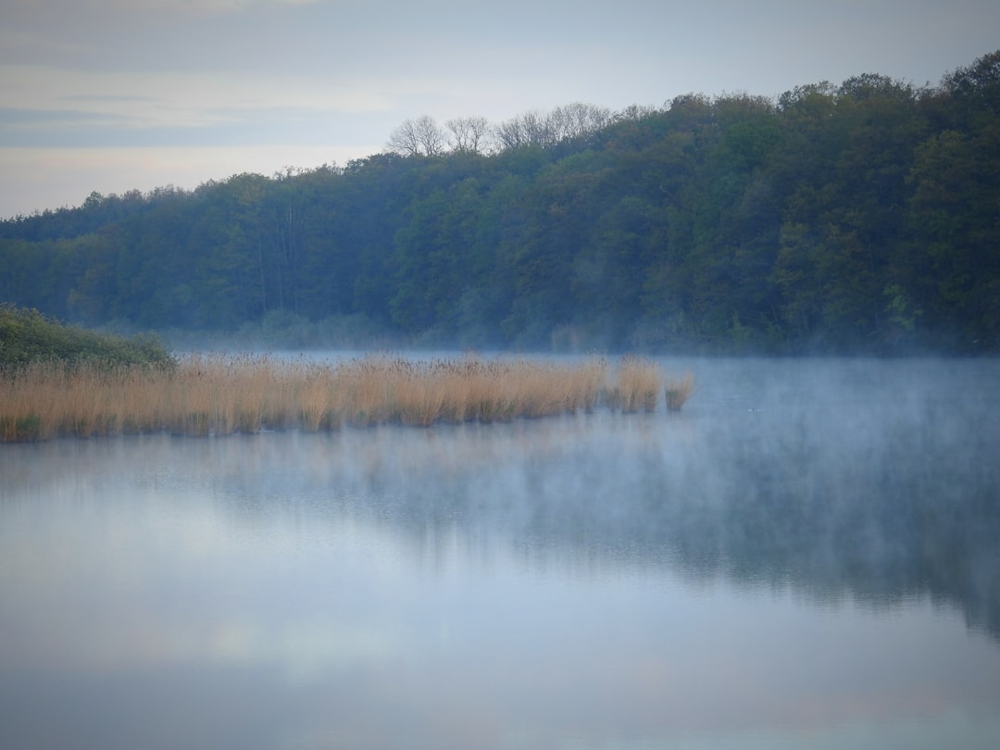

## 第16候 · Ashi hajimete shōzu

### "First reeds sprout"

> April 20-24 · 穀雨 Kokuu (Grain Rain)

**Why now?** Reeds begin pushing up from wetlands and riverbanks. These tall grasses will eventually form dense stands, but now they're just green spears emerging from mud.

**Insight:** Reeds are one of the fastest-growing plants—gaining visible height daily. But they start in mud, not despite it. Their growth medium looks unpromising, yet it provides exactly what they need.

**Today's practice:** Measure growth that others might not see yet. Track your own daily progress.

> **💬** "The bamboo that bends is stronger than the oak that resists."
> — Japanese Proverb

**Learn more:**

- [Common Reed](https://en.wikipedia.org/wiki/Phragmites)
- [Grain Rain Solar Term](https://en.wikipedia.org/wiki/Grain_Rain)
