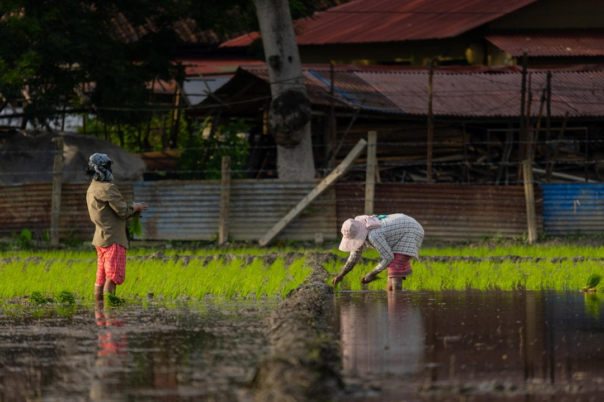

## 第17候 · Shimo yamite nae izuru

### "Last frost, rice seedlings grow"

> April 25-29 · 穀雨 Kokuu (Grain Rain)

**Why now?** The last frost passes and rice seedlings can safely be transplanted into paddies. Farmers watch temperature carefully—too early and seedlings freeze, too late and the growing season shortens.

**Insight:** Timing matters immensely for rice farmers. They don't rush, but they don't delay either. The window exists; the task is recognizing it and acting within it. Patience and decisiveness aren't opposites.

**Today's practice:** Identify a 'last frost' in your timeline—a constraint that defines when you must act. Plan around it.

> **💬** "The day you plant the seed is not the day you eat the fruit."
> — Fabienne Fredrickson

**Learn more:**

- [Rice Cultivation Japan](https://www.japan-guide.com/e/e2059.html)
- [Frost-Free Date](https://en.wikipedia.org/wiki/Frost#Frost-free_dates)
