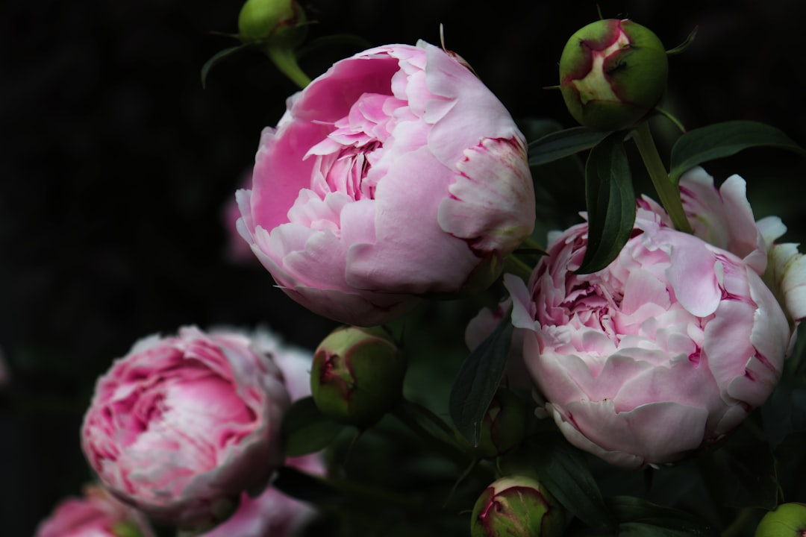

## 第18候 · Botan hana saku

### "Peonies bloom"

> April 30-May 4 · 穀雨 Kokuu (Grain Rain)

**Why now?** Peonies burst into bloom with their large, fragrant flowers. In China and Japan, they're called the 'king of flowers' for their dramatic beauty and association with prosperity.

**Insight:** The peony doesn't apologize for its extravagance. It blooms fully, without restraint. There's a season for subtlety and a season for splendor. Late spring is for bold expression.

**Today's practice:** Bloom boldly in one area. Let yourself be extravagant.

> **💬** "Spring is the time of plans and projects."
> — Leo Tolstoy

**Learn more:**

- [Peony in Japanese Culture](https://en.wikipedia.org/wiki/Paeonia_lactiflora#Cultural_significance)
- [Botan (Peony) Symbolism](https://www.japan-guide.com/e/e2012.html)
