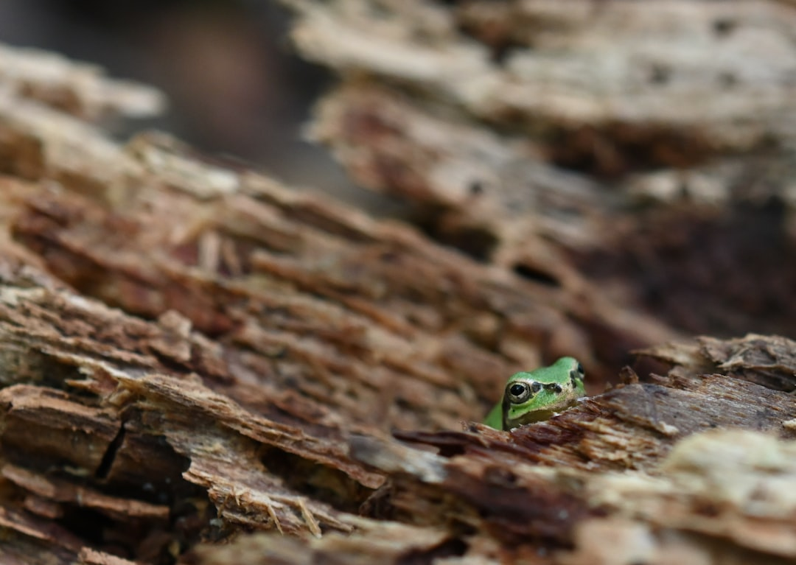

## 第19候 · Kawazu hajimete naku

### "Frogs start singing"

> May 5-9 · 立夏 Rikka (Beginning of Summer)

**Why now?** Frogs begin their chorus as temperatures warm. The songs of male frogs fill evening air near ponds and rice paddies, announcing the start of breeding season.

**Insight:** Frogs don't wait for permission to sing—they respond to conditions. When warmth arrives, they raise their voices. They're not performing; they're participating in the season.

**Today's practice:** Announce yourself tonight. Let the day end with expression, not just completion.

> **💬** "In summer, the song sings itself."
> — William Carlos Williams

**Learn more:**

- [Japanese Tree Frog](https://en.wikipedia.org/wiki/Japanese_tree_frog)
- [Kodomo no Hi](https://www.japan-guide.com/e/e2281.html)
