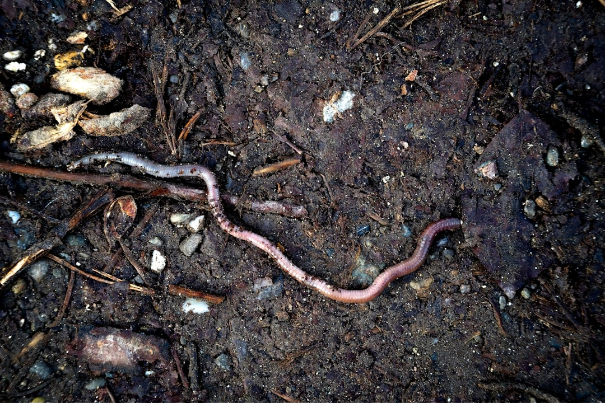

## 第20候 · Mimizu izuru

### "Worms surface"

> May 10-14 · 立夏 Rikka (Beginning of Summer)

**Why now?** Earthworms surface as soil warms, their tunneling visible in fresh castings. These essential creatures aerate soil and process organic matter, doing vital work mostly unseen.

**Insight:** Worms do critical work underground, out of sight. Their contribution is enormous but unglamorous. Not all important work is visible; some of the most essential processes happen below the surface.

**Today's practice:** Appreciate infrastructure—the systems and people that make visible work possible.

> **💬** "We are not apart from nature, we are a part of nature."
> — Unknown

**Learn more:**

- [Earthworm Ecology](https://en.wikipedia.org/wiki/Earthworm)
- [Soil Health](https://www.nature.com/articles/nature11069)
