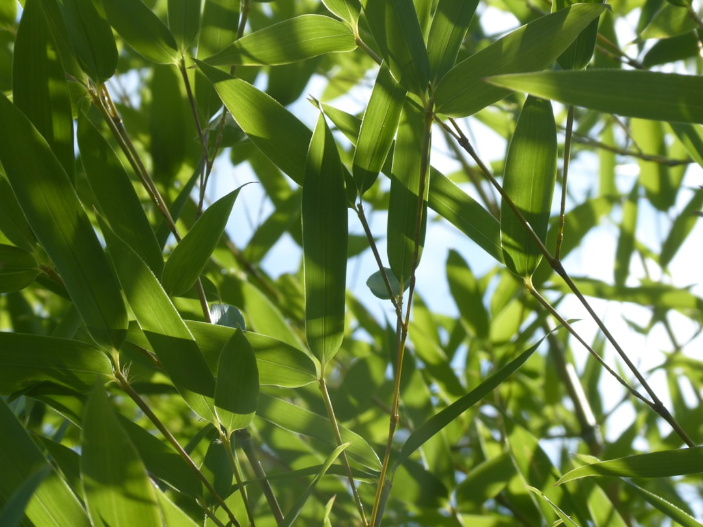

## 第21候 · Takenoko shōzu

### "Bamboo shoots sprout"

> May 15-20 · 立夏 Rikka (Beginning of Summer)

**Why now?** Bamboo shoots push through soil with tremendous force—some species can grow nearly a meter in a single day. This growth was prepared by the root system for years; expression is sudden but preparation was long.

**Insight:** The bamboo shoot's rapid growth is backed by years of root development. What looks like overnight success has deep preparation beneath it. Speed comes from foundation.

**Today's practice:** Eat bamboo shoots if possible—consume the lesson literally.

> **💬** "A society grows great when old people plant trees whose shade they know they shall never sit in."
> — Greek Proverb

**Learn more:**

- [Bamboo Shoots in Japanese Cuisine](https://www.nippon.com/en/japan-topics/c15302/)
- [Bamboo Growth](https://en.wikipedia.org/wiki/Bamboo#Ecology)
