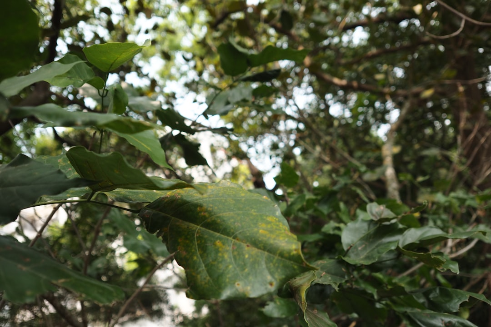

## 第22候 · Kaiko okite kuwa wo hamu

### "Silkworms start feasting on mulberry"

> May 21-25 · 小満 Shōman (Grain Buds)

**Why now?** Silkworms begin their intensive feeding period, consuming mulberry leaves voraciously. This concentrated eating will fuel their transformation into pupae and eventually silk moths.

**Insight:** The silkworm's focused feeding isn't indulgence—it's preparation. They consume intensively because transformation requires resources. Sometimes you need to take in more before you can give out.

**Today's practice:** Feed yourself what you need for an upcoming transformation. Input precedes output.

> **💬** "Amateurs sit and wait for inspiration, the rest of us just get up and go to work."
> — Stephen King

**Learn more:**

- [Sericulture in Japan](https://en.wikipedia.org/wiki/Sericulture#Japan)
- [Silkworm Lifecycle](https://en.wikipedia.org/wiki/Bombyx_mori)
