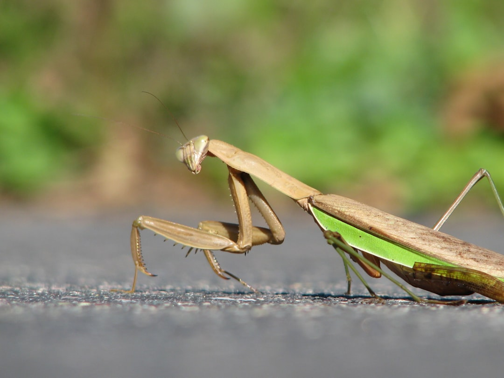

## 第25候 · Kamakiri shōzu

### "Praying mantises hatch"

> June 6-10 · 芒種 Bōshu (Grain in Ear)

**Why now?** Praying mantis egg cases hatch, releasing hundreds of tiny mantises. These predators will grow to be important controllers of garden pests, but now they're minuscule and vulnerable.

**Insight:** The mantis starts small but is already a hunter. Form follows function from the beginning—it doesn't become a predator, it was always one. Your nature is present from the start, even in miniature.

**Today's practice:** Protect something vulnerable that has potential. Guard the hatchling.

> **💬** "When you do something, you should burn yourself up completely, like a good bonfire, leaving no trace of yourself."
> — Shunryu Suzuki

**Learn more:**

- [Praying Mantis Life Cycle](https://en.wikipedia.org/wiki/Mantis#Reproduction_and_life_cycle)
- [Tsuyu - Rainy Season](https://www.japan-guide.com/e/e2277.html)
