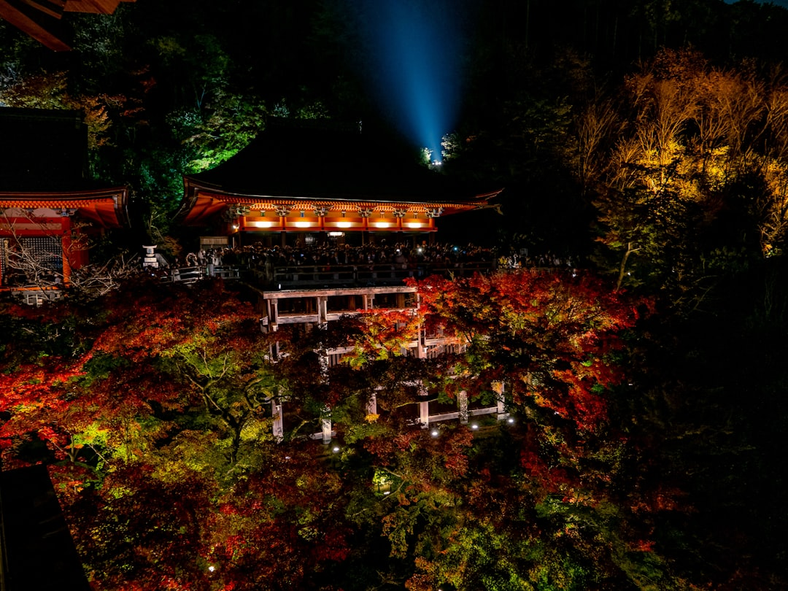

## 第26候 · Kusaretaru kusa hotaru to naru

### "Rotten grass becomes fireflies"

> June 11-15 · 芒種 Bōshu (Grain in Ear)

**Why now?** Fireflies begin to appear near water, their bioluminescence visible on warm early summer nights. Ancient Japanese believed they emerged from decaying grass, light from rot—transformation of the humble into the magical.

**Insight:** The firefly creates light from within—no external power source, just chemistry and intent. You carry your own illumination. Even in decay, there is potential for light.

**Today's practice:** Sit in darkness and appreciate points of light—literal or metaphorical.

> **💬** "Even a small star shines in the darkness."
> — Finnish Proverb

**Learn more:**

- [Fireflies in Japan](https://www.japan-guide.com/e/e2302.html)
- [Bioluminescence](https://en.wikipedia.org/wiki/Bioluminescence)
