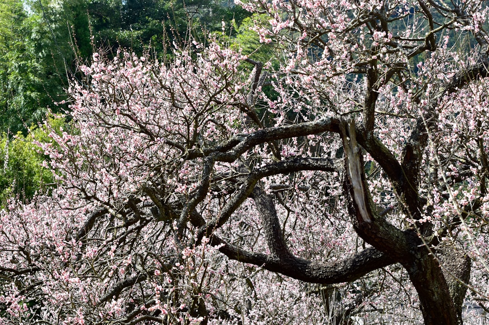

## 第27候 · Ume no mi kibamu

### "Plums turn yellow"

> June 16-20 · 芒種 Bōshu (Grain in Ear)

**Why now?** Plums reach ripeness, turning from green to yellow. This is the season for making umeboshi (pickled plums) and umeshu (plum wine)—preserving summer's abundance for the year ahead.

**Insight:** Ripe plums must be processed quickly—their moment of perfection is brief. Preservation extends this moment's value into the future. Capture abundance when it arrives; store it skillfully.

**Today's practice:** Process an abundance before it spoils. Don't let surplus become waste.

> **💬** "First, solve the problem. Then, write the code."
> — John Johnson

**Learn more:**

- [Umeshu - Plum Wine](https://en.wikipedia.org/wiki/Umeshu)
- [Umeboshi](https://en.wikipedia.org/wiki/Umeboshi)
