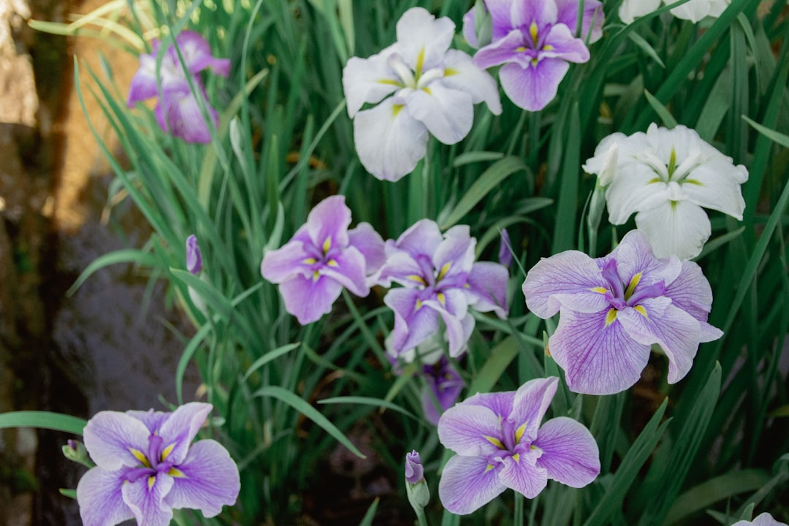

## 第29候 · Ayame hana saku

### "Irises bloom"

> June 27-July 1 · 夏至 Geshi (Summer Solstice)

**Why now?** Japanese irises bloom in dramatic purple, blue, and white. These moisture-loving flowers thrive in rainy season conditions that challenge other plants. They're at their best when it's wet.

**Insight:** The iris doesn't just tolerate rain—it flourishes in it. Some conditions that seem adverse are actually ideal, depending on what you're growing. Find what thrives in your particular weather.

**Today's practice:** Visit water today if possible. Let wetness be welcome.

> **💬** "Summer afternoon—summer afternoon; to me those have always been the two most beautiful words in the English language."
> — Henry James

**Learn more:**

- [Iris Gardens Japan](https://www.japan-guide.com/e/e2303.html)
- [Iris Flower Symbolism](https://en.wikipedia.org/wiki/Iris_(plant))
