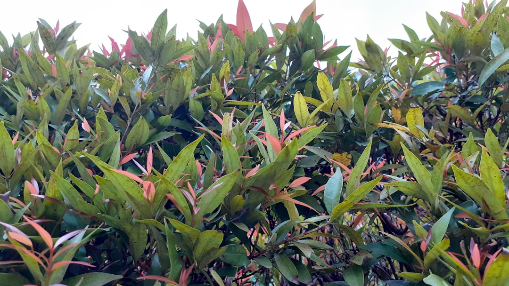

## 第30候 · Hange shōzu

### "Crow-dipper sprouts"

> July 2-6 · 夏至 Geshi (Summer Solstice)

**Why now?** The crow-dipper (hange) sprouts as the summer solstice passes. This medicinal plant marks the transition into true summer—five days before and after the solstice.

**Insight:** Hange emerges at the pivot point of the year's longest days. It marks transition precisely, growing in the exact moment of seasonal shift. Some things exist to mark thresholds.

**Today's practice:** Notice what emerges during pivotal moments. What grows at your turning points?

> **💬** "Live in the sunshine, swim the sea, drink the wild air."
> — Ralph Waldo Emerson

**Learn more:**

- [Pinellia ternata](https://en.wikipedia.org/wiki/Pinellia_ternata)
- [Hange - Calendar Division](https://en.wikipedia.org/wiki/Japanese_calendar#Seasonal_divisions)
