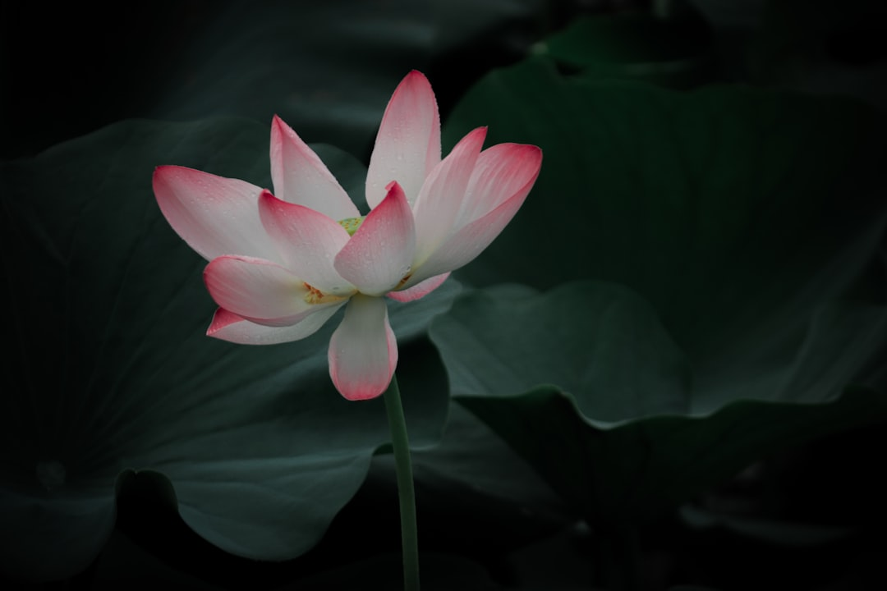

## 第32候 · Hasu hajimete hiraku

### "First lotus blossoms"

> July 12-16 · 小暑 Shōsho (Minor Heat)

**Why now?** Lotus flowers open in ponds and temple gardens, blooming from murky water with pristine petals. This emergence of purity from mud is a central Buddhist symbol.

**Insight:** The lotus needs mud to bloom—it's not despite the murk, but because of it. Nutrients in dark water feed the pristine flower. Our difficult circumstances may be feeding something beautiful.

**Today's practice:** Find nourishment in difficult circumstances. What's feeding you that looks like mud?

> **💬** "Sitting quietly, doing nothing, spring comes, and the grass grows by itself."
> — Zen saying

**Learn more:**

- [Lotus in Buddhism](https://en.wikipedia.org/wiki/Nelumbo_nucifera#Cultural_and_religious_significance)
- [Lotus Ponds Japan](https://www.japan-guide.com/e/e2303.html)
