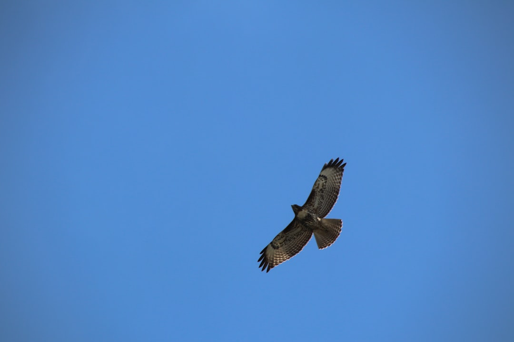

## 第33候 · Taka sunawachi waza wo narau

### "Hawks learn to fly"

> July 17-22 · 小暑 Shōsho (Minor Heat)

**Why now?** Young hawks leave their nests and begin learning to fly and hunt. This period of clumsy practice is essential—they must fail repeatedly before they become skilled predators.

**Insight:** Hawks aren't born able to hunt—they learn through awkward attempts and frequent failure. Mastery requires a period of incompetence. The expert was once the beginner falling from branches.

**Today's practice:** Practice something clumsily today. Let yourself be a beginner.

> **💬** "The best way to predict the future is to implement it."
> — David Heinemeier Hansson

**Learn more:**

- [Falconry in Japan](https://en.wikipedia.org/wiki/Falconry#Japan)
- [Hawk Development](https://en.wikipedia.org/wiki/Hawk#Reproduction)
