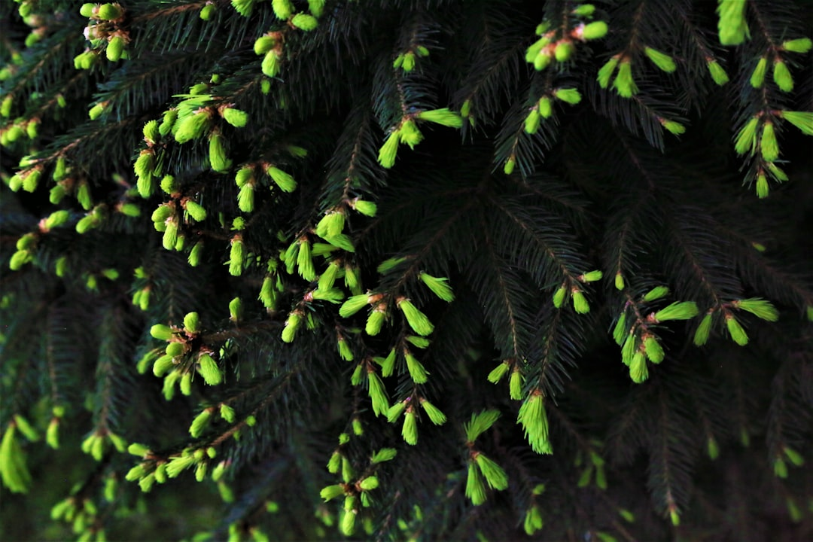

## 第34候 · Kiri hajimete hana wo musubu

### "Paulownia produces seeds"

> July 23-28 · 大暑 Taisho (Major Heat)

**Why now?** Paulownia trees produce their seeds in summer heat, preparing for autumn dispersal. These fast-growing trees are traditionally planted when a daughter is born, harvested for her wedding furniture when she marries.

**Insight:** The paulownia grows fast but is planted with long-term intent. Speed and patience aren't opposites—they serve different time horizons. Some things grow quickly toward distant goals.

**Today's practice:** Consider what you're building for the next generation.

> **💬** "The creation of a thousand forests is in one acorn."
> — Ralph Waldo Emerson

**Learn more:**

- [Paulownia Tree](https://en.wikipedia.org/wiki/Paulownia)
- [Doyo no Ushi](https://www.japan-guide.com/e/e2062.html)
