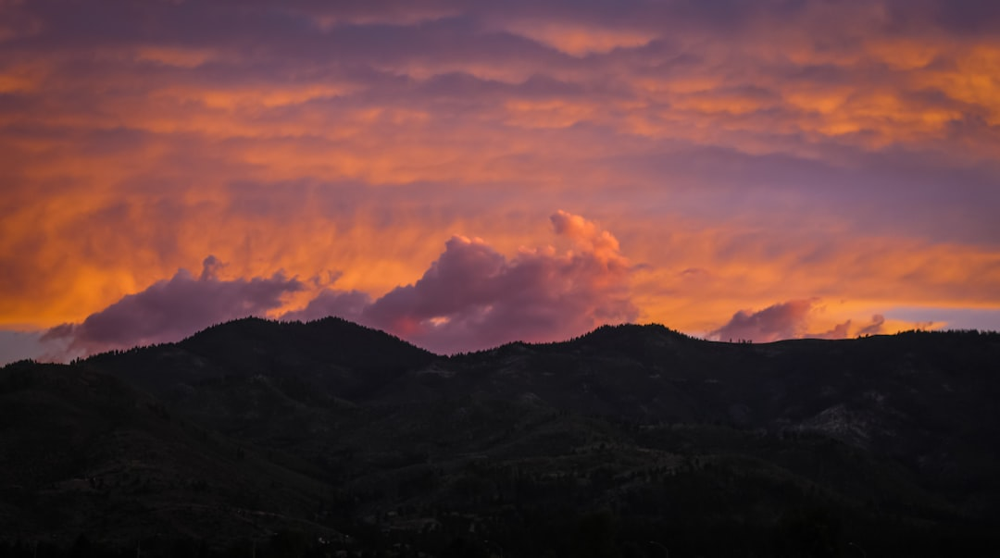

## 第36候 · Taiu tokidoki furu

### "Great rains sometimes fall"

> August 3-7 · 大暑 Taisho (Major Heat)

**Why now?** Sudden heavy rains fall—summer storms that arrive quickly, drop significant water, and often pass just as fast. These downpours provide relief but can also flood.

**Insight:** Great rains come suddenly and don't last. Intensity is often brief. When the deluge arrives, shelter and wait—it will pass, leaving nourishment and destruction in its wake.

**Today's practice:** Prepare for sudden intensity. Keep an umbrella metaphor for your life.

> **💬** "The cure for anything is salt water: sweat, tears, or the sea."
> — Isak Dinesen

**Learn more:**

- [Monsoon in Japan](https://en.wikipedia.org/wiki/East_Asian_monsoon)
- [Summer Storms](https://www.jma.go.jp/jma/indexe.html)
