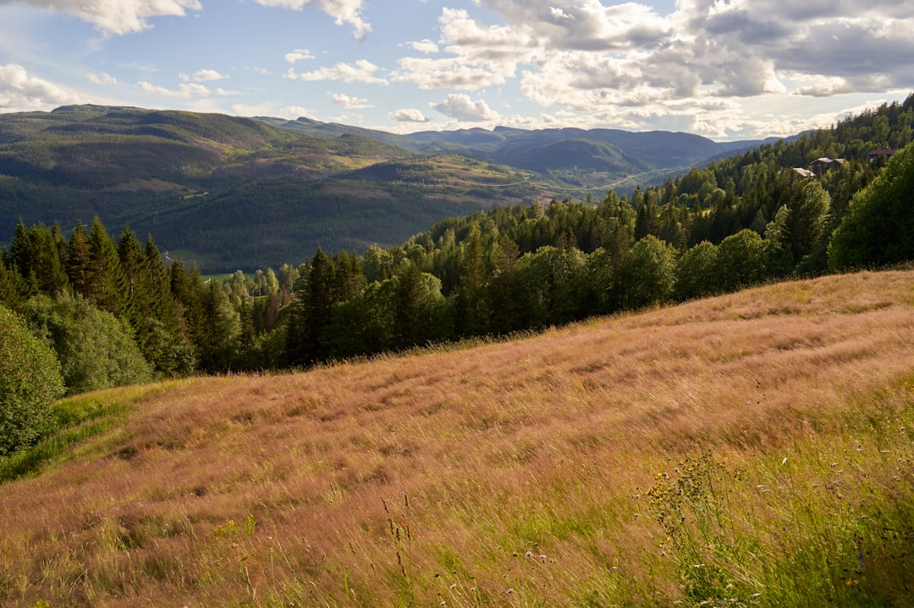

## 第37候 · Suzukaze itaru

### "Cool winds blow"

> August 8-12 · 立秋 Risshū (Beginning of Autumn)

**Why now?** The first cool winds of autumn arrive, subtle hints of change even while summer heat persists. These breezes are advance notice—autumn is coming, though summer isn't finished.

**Insight:** Cool wind in hot weather is a message from the future. Change announces itself with hints before it arrives in force. Sensitivity catches these signals; habit ignores them.

**Today's practice:** Welcome relief, even if temporary and small. The cool wind is real even if summer persists.

> **💬** "Autumn is a second spring when every leaf is a flower."
> — Albert Camus

**Learn more:**

- [Autumn Breeze Poetry](https://en.wikipedia.org/wiki/Autumn#Cultural_associations)
- [Obon Festival](https://www.japan-guide.com/e/e2286.html)
