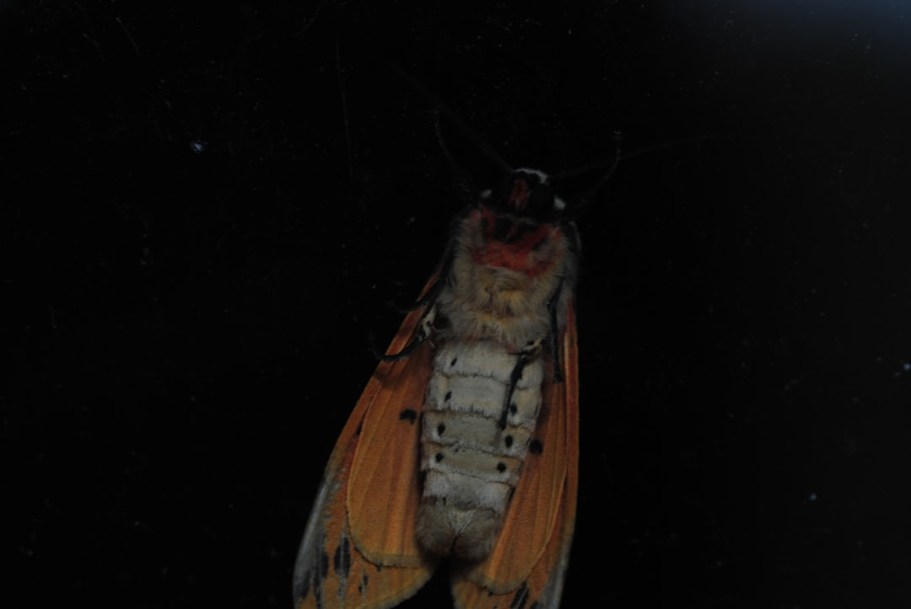

## 第38候 · Higurashi naku

### "Evening cicadas sing"

> August 13-17 · 立秋 Risshū (Beginning of Autumn)

**Why now?** Higurashi (evening cicadas) begin their distinctive singing at dusk, a melancholic sound associated with late summer and the approaching end of the season.

**Insight:** The higurashi sings at day's end, marking transition from light to dark. Its song is beautiful and sad—the beauty of endings, the recognition that this won't last.

**Today's practice:** Create something appropriate for dusk—a closing activity, a winding down.

> **💬** "The quieter you become, the more you are able to hear."
> — Rumi

**Learn more:**

- [Evening Cicada](https://en.wikipedia.org/wiki/Tanna_japonensis)
- [Cicada Songs Japan](https://www.japan-guide.com/e/e2312.html)
