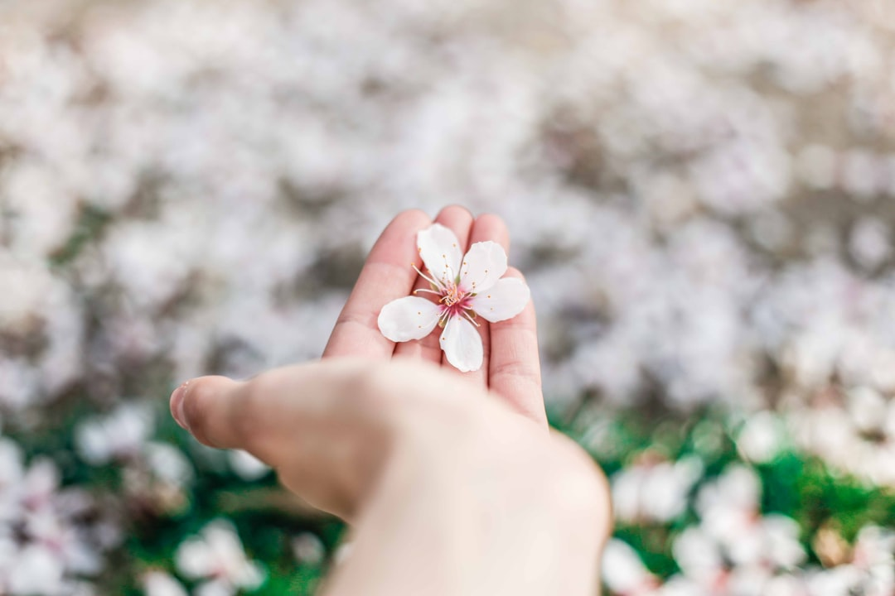

## 第40候 · Wata no hana shibe hiraku

### "Cotton flowers bloom"

> August 23-27 · 処暑 Shosho (Limit of Heat)

**Why now?** Cotton plants produce their flowers, soon to be followed by the cotton bolls that will be harvested for fiber. This flowering marks the beginning of the end of agricultural summer.

**Insight:** Cotton flowers are the first step toward a practical harvest—not food but fiber, not immediate but processed. Some growth is for utility discovered through transformation.

**Today's practice:** Create something that others will complete. Your flowering enables their harvest.

> **💬** "Notice that autumn is more the season of the soul than of nature."
> — Friedrich Nietzsche

**Learn more:**

- [Cotton Plant](https://en.wikipedia.org/wiki/Gossypium)
- [End of Summer Japan](https://www.japan-guide.com/e/e2012.html)
