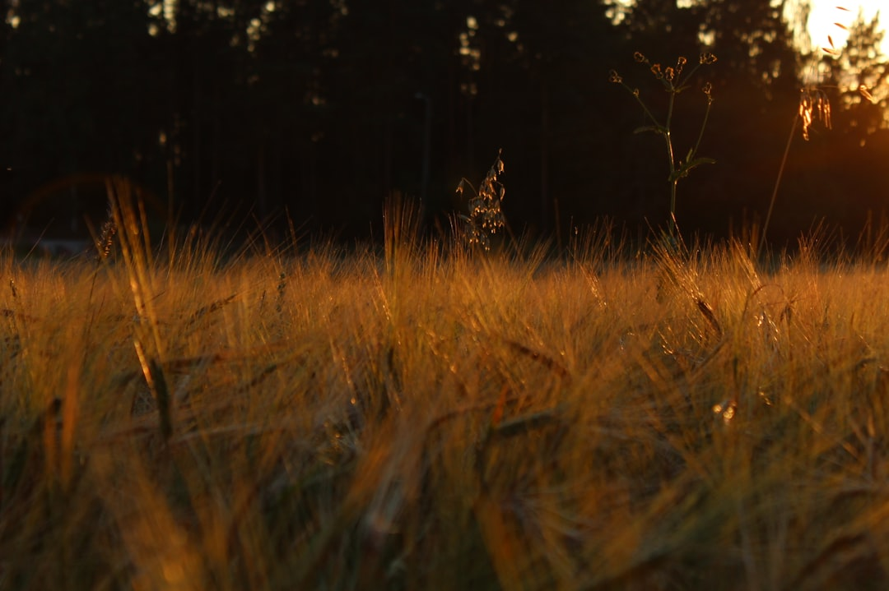

## 第41候 · Tenchi hajimete samushi

### "Heat starts to die down"

> August 28-September 1 · 処暑 Shosho (Limit of Heat)

**Why now?** Summer's heat begins to die down as the sun's angle lowers. Days are still warm but lack the intensity of peak summer. The limit has been reached; decline begins.

**Insight:** Peaks pass by definition—they're the point beyond which decline begins. Recognizing the limit of heat is recognizing that intensity cannot be sustained indefinitely. Relief is approaching.

**Today's practice:** Prepare for a calmer phase. What will you do with reduced intensity?

> **💬** "Life starts all over again when it gets crisp in the fall."
> — F. Scott Fitzgerald

**Learn more:**

- [End of Summer Japan](https://www.japan-guide.com/e/e2012.html)
- [Jizo Festival](https://en.wikipedia.org/wiki/Jiz%C5%8D)
