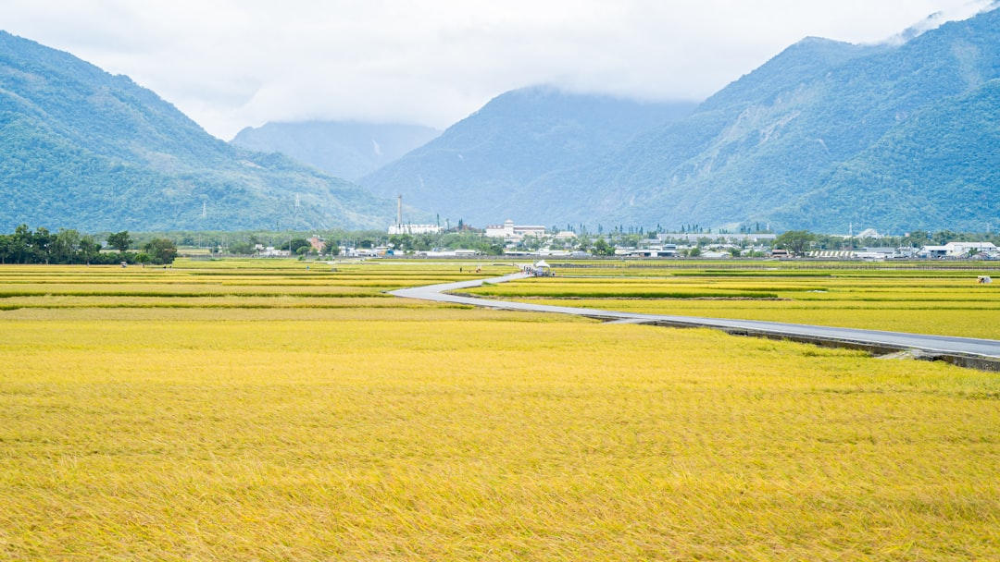

## 第42候 · Kokumono sunawachi minoru

### "Rice ripens"

> September 2-7 · 処暑 Shosho (Limit of Heat)

**Why now?** Rice in the paddies ripens and begins to turn golden. Months of growth reach their culmination—the grain is ready or nearly ready for harvest.

**Insight:** Ripening is the conversion of growth into yield. All the water, sun, and care now becomes something harvestable. The work shifts from cultivation to collection.

**Today's practice:** Trust that your work is reaching fruition. The grain remembers every day of growth.

> **💬** "Make it work, make it right, make it fast."
> — Kent Beck

**Learn more:**

- [Rice Harvest](https://www.japan-guide.com/e/e2059.html)
- [Rice Cultivation](https://en.wikipedia.org/wiki/Rice#Harvesting)
