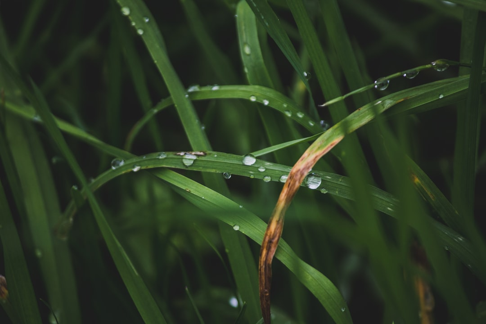

## 第43候 · Kusa no tsuyu shiroshi

### "Dew glistens white on grass"

> September 8-12 · 白露 Hakuro (White Dew)

**Why now?** Morning dew forms thicker now, glistening white on grass as nights cool. This 'white dew' is visible evidence of autumn's approach—water condensing on surfaces that couldn't cool enough in summer.

**Insight:** Dew reveals what was always there—moisture in the air, made visible by cooling. The water didn't arrive; conditions changed to reveal it. Sometimes our circumstances must shift before we see what's present.

**Today's practice:** Cool down emotionally. What appears when intensity drops?

> **💬** "Those who contemplate the beauty of the earth find reserves of strength that will endure as long as life lasts."
> — Rachel Carson

**Learn more:**

- [Dew Formation](https://en.wikipedia.org/wiki/Dew)
- [Tsukimi - Moon Viewing](https://www.japan-guide.com/e/e2062.html)
