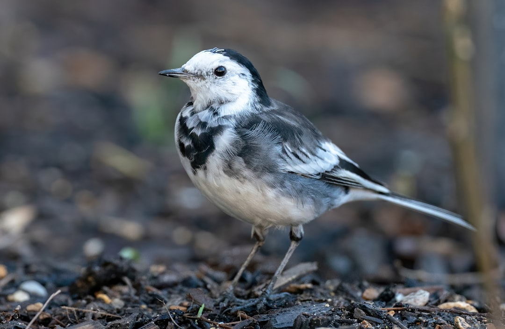

## 第44候 · Sekirei naku

### "Wagtails sing"

> September 13-17 · 白露 Hakuro (White Dew)

**Why now?** Wagtails begin their clear, distinctive singing as autumn progresses. These small birds have adapted to human environments and are often seen near houses and streams.

**Insight:** The wagtail adapts to human spaces, thriving where others can't. Its song in autumn is a reminder that adaptation brings presence—being able to sing in places others avoid.

**Today's practice:** Adapt to circumstances others find inhospitable. Find your song in difficult places.

> **💬** "Every leaf speaks bliss to me, fluttering from the autumn tree."
> — Emily Brontë

**Learn more:**

- [Japanese Wagtail](https://en.wikipedia.org/wiki/Japanese_wagtail)
- [Autumn Birds Japan](https://www.japan-guide.com/e/e2012.html)
