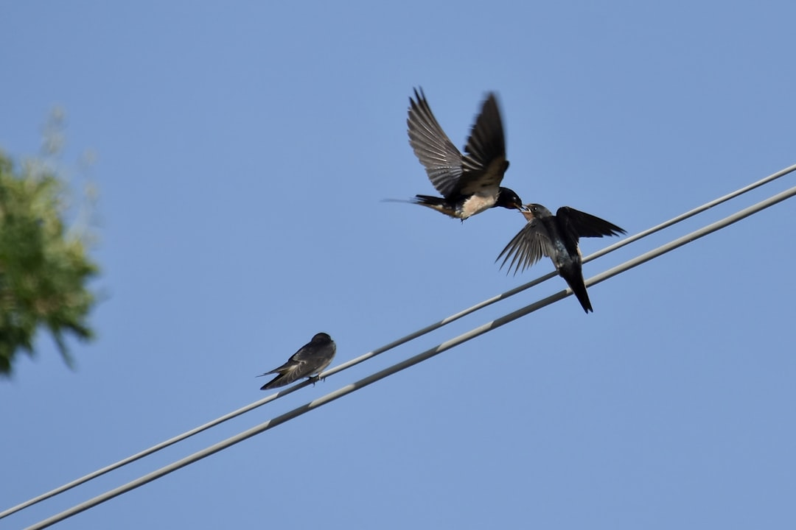

## 第45候 · Tsubame saru

### "Swallows leave"

> September 18-22 · 白露 Hakuro (White Dew)

**Why now?** Swallows that arrived in spring now depart for their southern wintering grounds. The birds that announced spring's arrival now announce autumn's deepening.

**Insight:** Departure completes the cycle begun by arrival. The swallows go; they'll return next spring. Not everything stays—some visitors are seasonal by nature, and their leaving is as much part of the rhythm as their coming.

**Today's practice:** Let something leave that came for a season. Don't hold what needs to go.

> **💬** "Rivers know this: there is no hurry. We shall get there some day."
> — A.A. Milne

**Learn more:**

- [Swallow Migration South](https://en.wikipedia.org/wiki/Barn_swallow#Migration)
- [Autumn in Japan](https://www.japan-guide.com/e/e2012.html)
