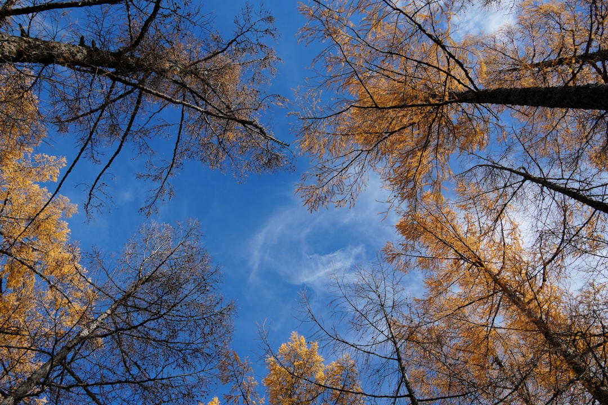

## 第46候 · Kaminari sunawachi koe wo osamu

### "Thunder ceases"

> September 23-27 · 秋分 Shūbun (Autumn Equinox)

**Why now?** Thunder ceases as autumn deepens—the atmospheric conditions that created summer storms no longer align. The quiet absence of thunder marks a seasonal shift.

**Insight:** The end of thunder is noticed by its absence. We often mark arrivals more than departures, beginnings more than endings. But what stops is as significant as what starts.

**Today's practice:** Listen for what's missing. What thunder has ceased in your life?

> **💬** "Wherever you are, be all there."
> — Jim Elliot

**Learn more:**

- [Autumn Weather Patterns](https://en.wikipedia.org/wiki/Equinox)
- [Shūbun no Hi](https://www.japan-guide.com/e/e2079.html)
