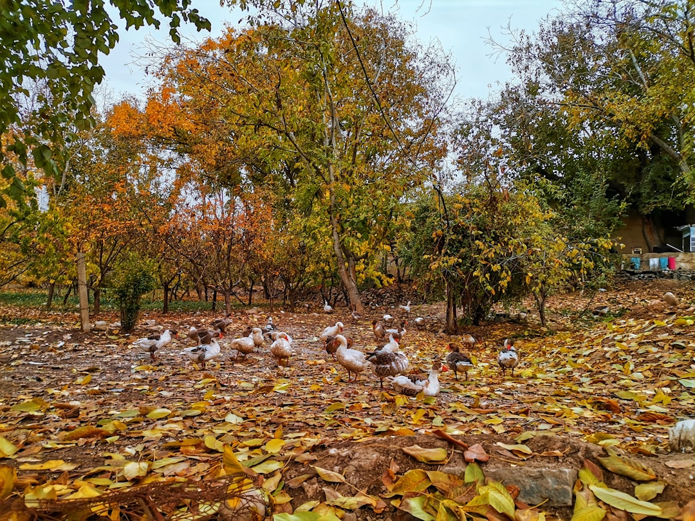

## 第49候 · Kōgan kitaru

### "Wild geese return"

> October 8-12 · 寒露 Kanro (Cold Dew)

**Why now?** Wild geese return from their northern breeding grounds to winter in Japan. Their V-formations overhead announce autumn's deepening—the same birds that left in spring now return.

**Insight:** The geese return to where they know they can survive winter. Migration is about matching location to season—being where conditions support you, moving when they change.

**Today's practice:** Return to something you left when conditions weren't right. Check if the season has changed.

> **💬** "If you want to go fast, go alone. If you want to go far, go together."
> — African Proverb

**Learn more:**

- [Goose Migration to Japan](https://en.wikipedia.org/wiki/Greater_white-fronted_goose)
- [Autumn Leaves Japan](https://www.japan-guide.com/e/e2014.html)
