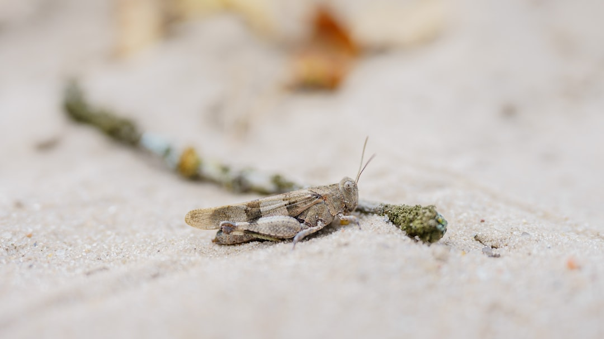

## 第51候 · Kirigirisu to ni ari

### "Crickets chirp in doorways"

> October 18-22 · 寒露 Kanro (Cold Dew)

**Why now?** Crickets chirp in doorways as nights cool, seeking residual warmth from human dwellings. Their song is a familiar autumn sound, associated with nostalgia and seasonal change.

**Insight:** Crickets at the threshold—not quite inside, not outside—sing at the edge. Boundaries are where life often gathers, seeking the best of both conditions.

**Today's practice:** Notice what gathers at your doorway. What's seeking warmth from your environment?

> **💬** "The old pond—a frog jumps in, sound of water."
> — Matsuo Bashō

**Learn more:**

- [Cricket Singing](https://en.wikipedia.org/wiki/Cricket_(insect)#Chirping)
- [Autumn Insects Japan](https://www.japan-guide.com/e/e2312.html)
