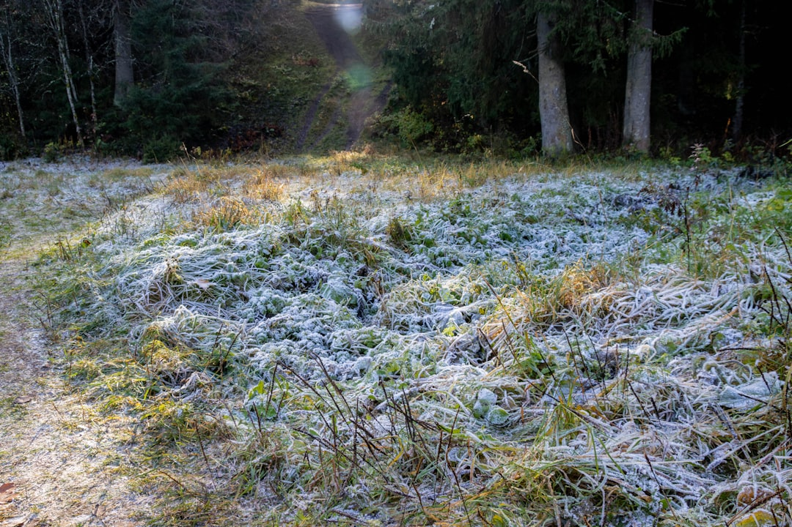

## 第52候 · Shimo hajimete furu

### "First frost"

> October 23-27 · 霜降 Sōkō (Frost Falls)

**Why now?** First frost appears on exposed surfaces—grass, car windows, fallen leaves. This thin white coating marks winter's first physical touch, killing tender plants and signaling coming cold.

**Insight:** Frost is winter's first mark on the landscape. It transforms what it touches, ending some lives while beginning a new phase. The first touch of change is often the hardest.

**Today's practice:** See beauty in frost—the crystalline transformation of what it touches.

> **💬** "The flower that blooms in adversity is the most rare and beautiful of all."
> — Mulan (Disney)

**Learn more:**

- [Frost Formation](https://en.wikipedia.org/wiki/Frost)
- [Autumn Colors Peak](https://www.japan-guide.com/e/e2014_when.html)
