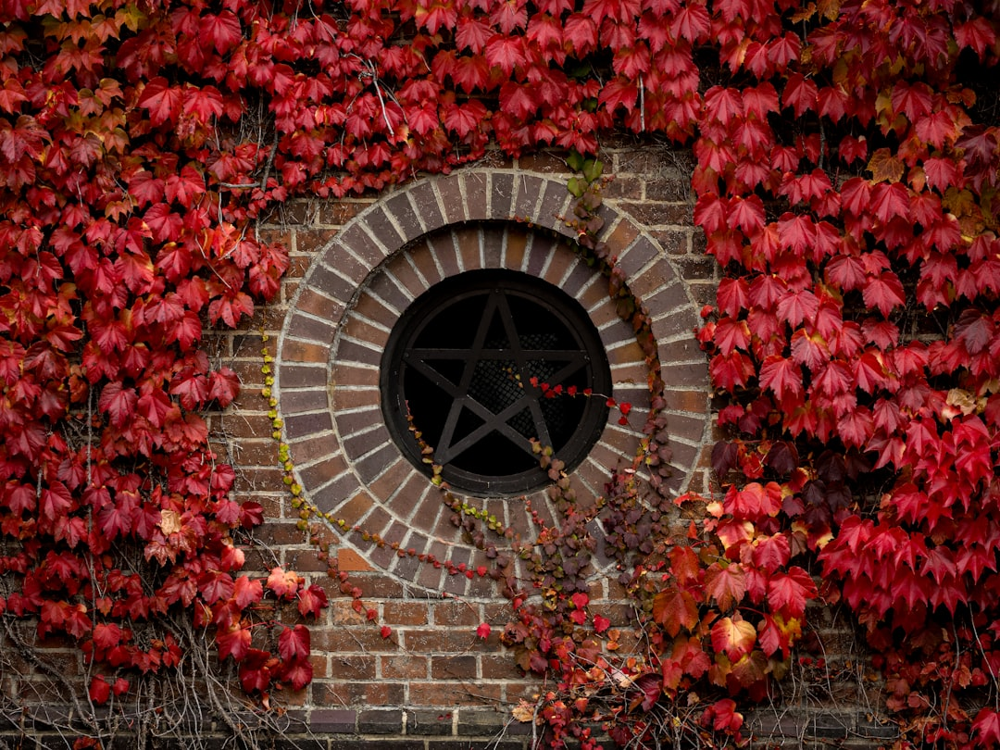

## 第54候 · Momiji tsuta kibamu

### "Maples and ivy turn yellow"

> November 2-6 · 霜降 Sōkō (Frost Falls)

**Why now?** Maples and ivy turn yellow and red as chlorophyll breaks down, revealing hidden pigments that were there all along. The fall colors are an unmasking, not a creation.

**Insight:** Autumn colors reveal what was always present, hidden by green. The tree doesn't create these pigments in fall—it stops hiding them. Sometimes beauty requires letting go of what obscures.

**Today's practice:** Stop hiding something that's actually beautiful. Let the green go.

> **💬** "Simplicity is the ultimate sophistication."
> — Leonardo da Vinci

**Learn more:**

- [Momijigari - Leaf Viewing](https://www.japan-guide.com/e/e2014.html)
- [Autumn Color Science](https://en.wikipedia.org/wiki/Autumn_leaf_color)
