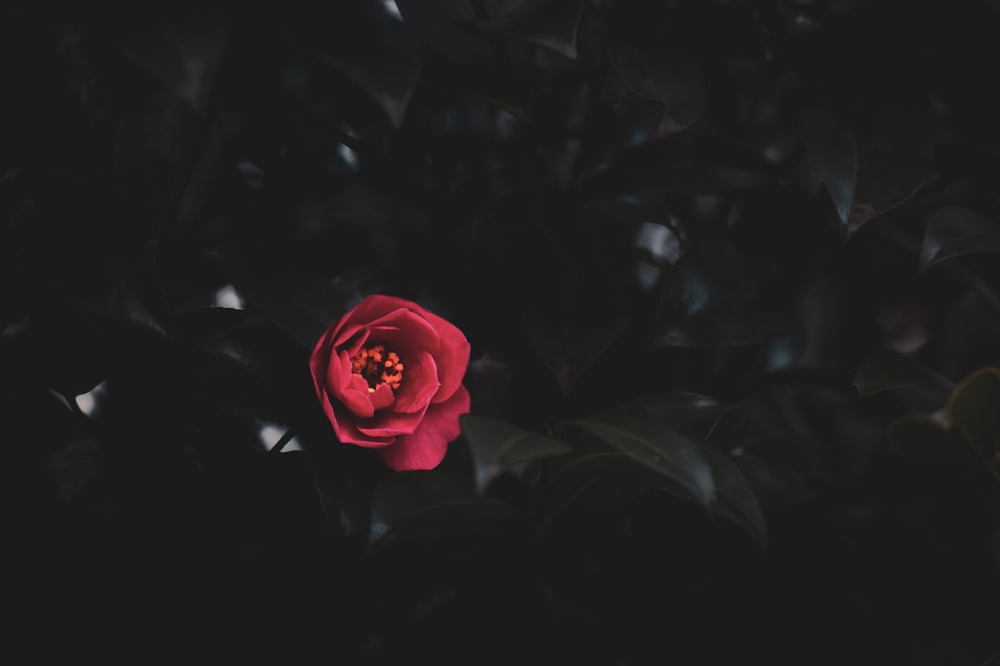

## 第55候 · Tsubaki hajimete hiraku

### "Camellias bloom"

> November 7-11 · 立冬 Rittō (Beginning of Winter)

**Why now?** Camellias bloom as most flowers have finished—these winter-hardy plants flower in the cold, bringing color to an increasingly stark landscape.

**Insight:** The camellia blooms when others can't—its strategy is countercyclical flowering. While competition rests, it has the stage to itself. There's opportunity in seasons others avoid.

**Today's practice:** Notice what thrives in conditions others find harsh. Learn from it.

> **💬** "I prefer winter and fall, when you feel the bone structure of the landscape. Something waits beneath it; the whole story doesn't show."
> — Andrew Wyeth

**Learn more:**

- [Camellia japonica](https://en.wikipedia.org/wiki/Camellia_japonica)
- [Shichi-Go-San Festival](https://www.japan-guide.com/e/e2282.html)
