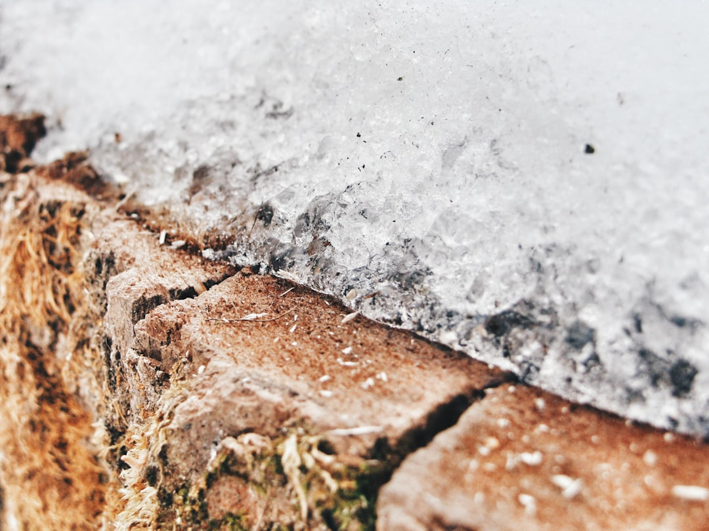

## 第56候 · Chi hajimete kōru

### "Land starts to freeze"

> November 12-16 · 立冬 Rittō (Beginning of Winter)

**Why now?** The ground begins to freeze at the surface, first in thin layers overnight that thaw by midday, then increasingly firm as cold deepens.

**Insight:** Freezing happens in layers—surface first, then gradually deeper. Slow change is still change. The imperceptible progress of cold eventually becomes hardness.

**Today's practice:** Notice gradual change. Slow doesn't mean nothing—it means building.

> **💬** "Look deep into nature, and then you will understand everything better."
> — Albert Einstein

**Learn more:**

- [Ground Frost](https://en.wikipedia.org/wiki/Ground_frost)
- [Early Winter Japan](https://www.japan-guide.com/e/e2012.html)
