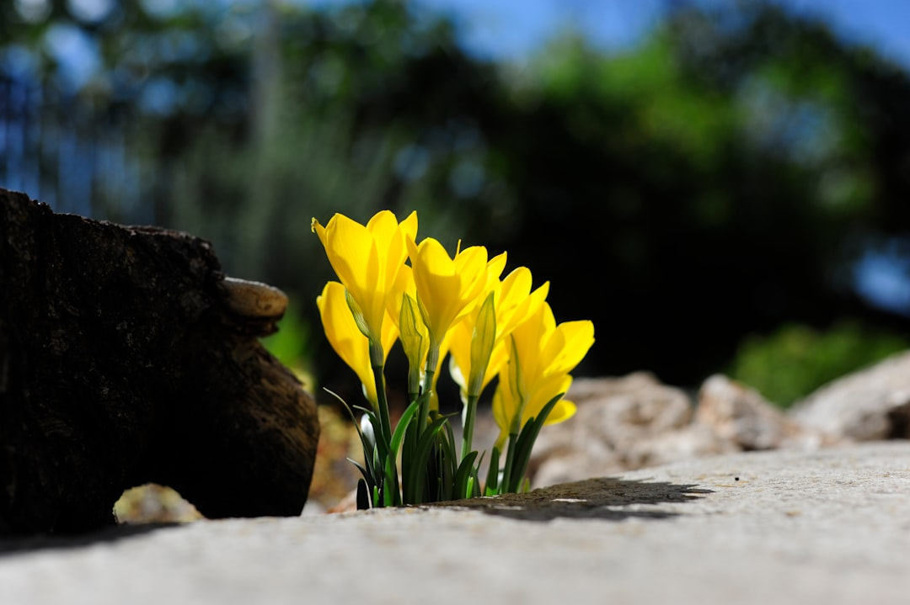

## 第57候 · Kinsenka saku

### "Daffodils bloom"

> November 17-21 · 立冬 Rittō (Beginning of Winter)

**Why now?** Winter daffodils (kinsenka) bloom in cold weather, their yellow flowers appearing as most other plants dormant. Like camellias, they bloom countercyclically.

**Insight:** Yellow flowers in winter are unexpected brightness—they don't match what we think winter should look like. Sometimes the most valuable contributions come from defying expectations.

**Today's practice:** Be bright when the world is gray. Your color matters more in contrast.

> **💬** "The best time to plant a tree was 20 years ago. The second best time is now."
> — Chinese Proverb

**Learn more:**

- [Winter Daffodil](https://en.wikipedia.org/wiki/Narcissus_(plant))
- [Winter Flowers Japan](https://www.japan-guide.com/e/e2012.html)
