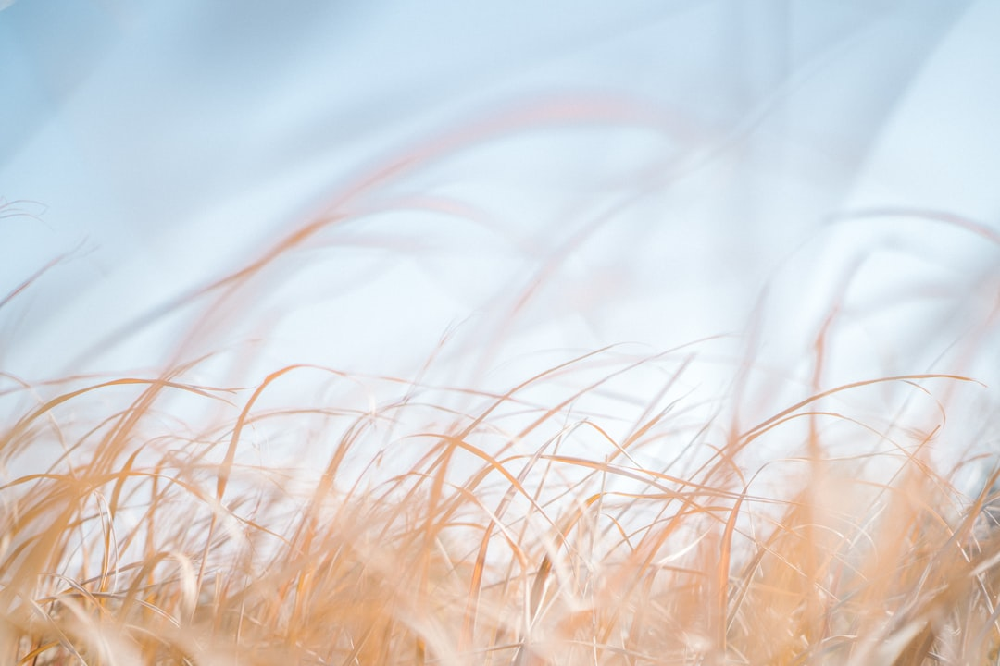

## 第59候 · Kitakaze konoha wo harau

### "North wind blows leaves"

> November 27-December 1 · 小雪 Shōsetsu (Minor Snow)

**Why now?** North winds blow the last leaves from branches, completing the trees' transition to bare winter form. The wind does what gravity alone couldn't—finishes the release.

**Insight:** The north wind completes what autumn started. Sometimes completion needs outside force; internal readiness meets external push. The tree let go; the wind carried away.

**Today's practice:** Accept brisk treatment. Sometimes kindness is quick completion.

> **💬** "Be like a tree and let the dead leaves drop."
> — Rumi

**Learn more:**

- [North Wind](https://en.wikipedia.org/wiki/North_wind)
- [Late Autumn Japan](https://www.japan-guide.com/e/e2012.html)
