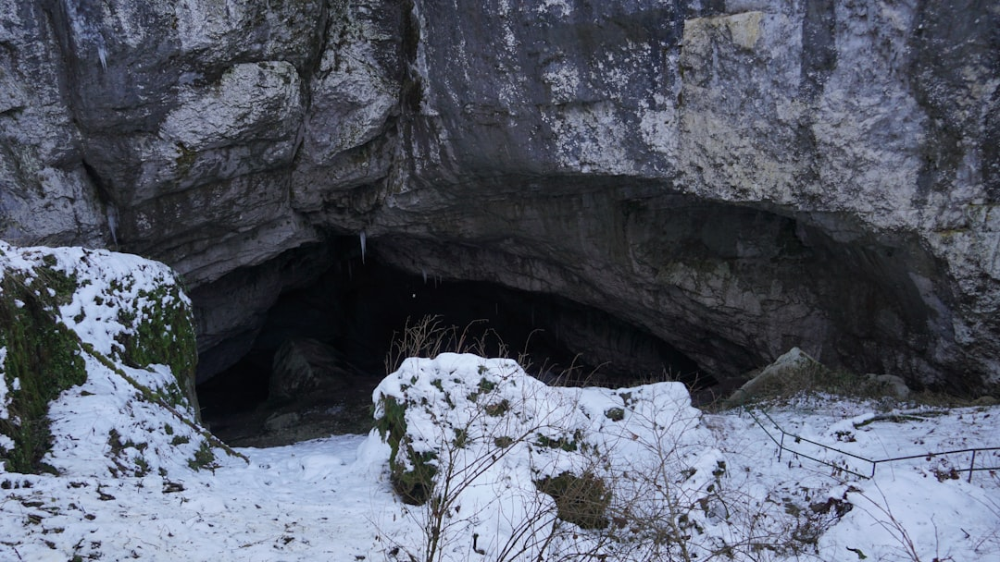

## 第62候 · Kuma ana ni komoru

### "Bears hibernate"

> December 12-16 · 大雪 Taisetsu (Major Snow)

**Why now?** Bears enter their dens for winter hibernation, slowing metabolism dramatically to survive months without eating. This withdrawal is survival strategy, not defeat.

**Insight:** The bear doesn't fight winter—it yields, slows, waits. Hibernation is active conservation, not passive giving up. Sometimes the wise response to harsh conditions is dramatic reduction.

**Today's practice:** Conserve for a hard season. Strategic withdrawal is strength.

> **💬** "In seed time learn, in harvest teach, in winter enjoy."
> — William Blake

**Learn more:**

- [Bear Hibernation](https://en.wikipedia.org/wiki/Hibernation#Bears)
- [Winter Survival](https://en.wikipedia.org/wiki/Hibernation)
