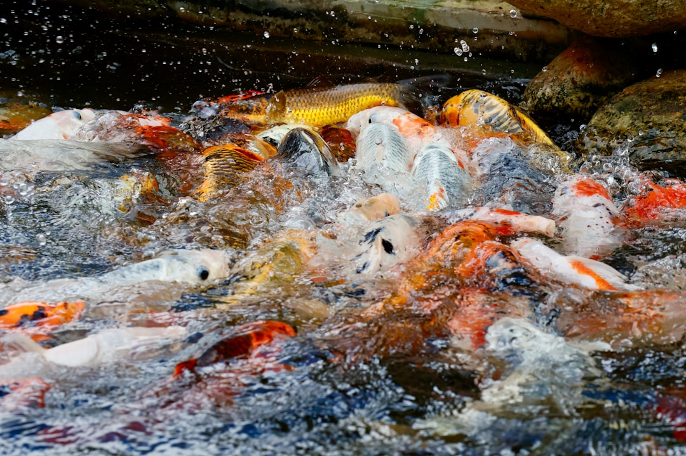

## 第63候 · Sake no uo muragaru

### "Salmon gather and swim upstream"

> December 17-21 · 大雪 Taisetsu (Major Snow)

**Why now?** Salmon gather to swim upstream to their spawning grounds—a final journey to the place they were born, where they will reproduce and die.

**Insight:** The salmon's final journey is about completion and continuation. They don't fight death; they swim toward their purpose, carrying the future in their bodies. Some endings are the most generative act possible.

**Today's practice:** Complete something that enables what comes next. Some endings are beginnings.

> **💬** "Fall seven times, stand up eight."
> — Japanese Proverb

**Learn more:**

- [Salmon Run Japan](https://en.wikipedia.org/wiki/Salmon_run)
- [Salmon Lifecycle](https://en.wikipedia.org/wiki/Salmon#Life_cycle)
