# Seasons Resources

Reference for the 72 micro-seasons with English translations, images, and curated links.

## Image Management

### Naming Convention

Images stored in `./images/` with format: `{number}-{romaji-slug}.jpg`

Example: `70-fuki-no-hana-saku.jpg`

### Download Script

```bash
# Download all images from Unsplash
export UNSPLASH_ACCESS_KEY="your-key"
uv run download_images.py

# Download specific kō
uv run download_images.py 70 71 72
```

See `download_images.py` for search terms and configuration.

---

## Spring (Feb 4 - May 4)

### 立春 Risshun (Beginning of Spring) — Feb 4-18

| #   | Romaji                | English                     | Image                                                        | Learn More                                                                   |
| --- | --------------------- | --------------------------- | ------------------------------------------------------------ | ---------------------------------------------------------------------------- |
| 1   | Harukaze kōri wo toku | East wind melts the ice     | 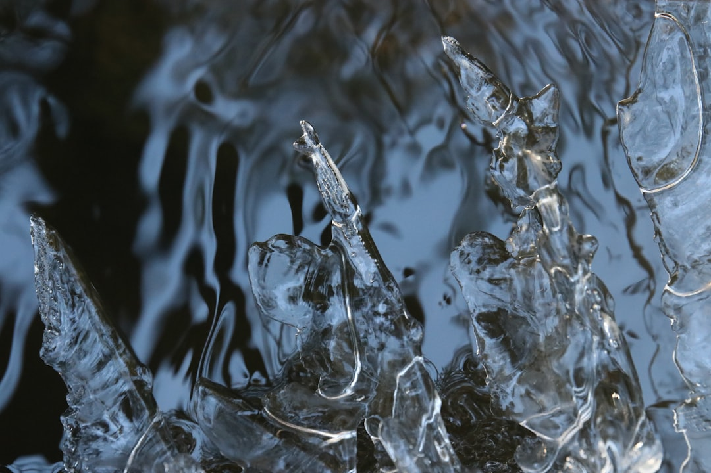 | [East Wind](https://en.wikipedia.org/wiki/East_wind)                         |
| 2   | Kōō kenkan su         | Bush warblers start singing |          | [Japanese Bush Warbler](https://en.wikipedia.org/wiki/Japanese_bush_warbler) |
| 3   | Uo kōri wo izuru      | Fish emerge from the ice    |       | [Ice Fishing Japan](https://livejapan.com/en/article-a0000766/)              |

**Sekki Resources:**

- [Risshun - Nippon.com](https://www.nippon.com/en/features/h00124/)
- [Spring in Japan](https://www.japan-guide.com/e/e2011.html)

---

### 雨水 Usui (Rainwater) — Feb 19-Mar 5

| #   | Romaji                    | English                  | Image                                                            | Learn More                                                        |
| --- | ------------------------- | ------------------------ | ---------------------------------------------------------------- | ----------------------------------------------------------------- |
| 4   | Tsuchi no shō uruoi okoru | Rain moistens the soil   |  | [Spring Rain Japan](https://www.japan-guide.com/e/e2011.html)     |
| 5   | Kasumi hajimete tanabiku  | Mist starts to linger    |   | [Kasumi - Japanese Mist](https://en.wikipedia.org/wiki/Haze)      |
| 6   | Sōmoku mebae izuru        | Grass sprouts, trees bud |         | [Tree Buds](https://en.wikipedia.org/wiki/Bud#Vegetative_budding) |

**Sekki Resources:**

- [Japanese Words for Rain](https://blog.gaijinpot.com/potsu-potsu-rain-summertime/)

---

### 啓蟄 Keichitsu (Awakening of Insects) — Mar 6-20

| #   | Romaji                     | English                         | Image                                                             | Learn More                                                                    |
| --- | -------------------------- | ------------------------------- | ----------------------------------------------------------------- | ----------------------------------------------------------------------------- |
| 7   | Sugomori mushito wo hiraku | Hibernating insects surface     |  | [Insect Dormancy](https://en.wikipedia.org/wiki/Diapause)                     |
| 8   | Momo hajimete saku         | First peach blossoms            |          | [Peach Blossom Japan](https://www.japan-guide.com/e/e2012.html)               |
| 9   | Namushi chō to naru        | Caterpillars become butterflies |         | [Butterfly Metamorphosis](https://en.wikipedia.org/wiki/Butterfly#Life_cycle) |

**Sekki Resources:**

- [Keichitsu - Insects Awaken](https://www.nippon.com/en/japan-topics/b09704/)

---

### 春分 Shunbun (Spring Equinox) — Mar 21-Apr 4

| #   | Romaji                          | English                | Image                                                                  | Learn More                                                                   |
| --- | ------------------------------- | ---------------------- | ---------------------------------------------------------------------- | ---------------------------------------------------------------------------- |
| 10  | Suzume hajimete sukū            | Sparrows start to nest | 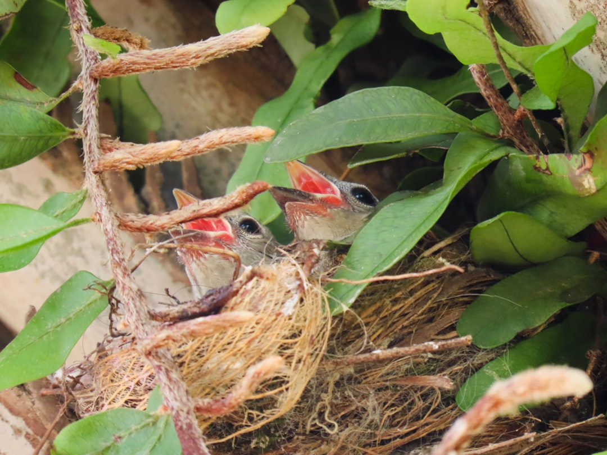            | [Eurasian Tree Sparrow](https://en.wikipedia.org/wiki/Eurasian_tree_sparrow) |
| 11  | Sakura hajimete saku            | First cherry blossoms  | 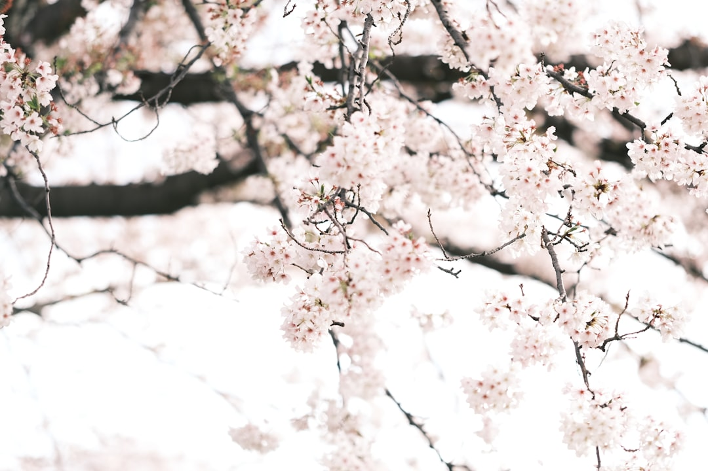            | [Cherry Blossom Forecast](https://www.japan-guide.com/e/e2011_when.html)     |
| 12  | Kaminari sunawachi koe wo hassu | Distant thunder        |  | [Spring Thunder](https://en.wikipedia.org/wiki/Thunderstorm#Spring)          |

**Sekki Resources:**

- [Shunbun no Hi (Equinox Day)](https://www.japan-guide.com/e/e2079.html)
- [Higan - Buddhist Observance](https://en.wikipedia.org/wiki/Higan)

---

### 清明 Seimei (Clear and Bright) — Apr 5-19

| #   | Romaji                | English              | Image                                                        | Learn More                                                                      |
| --- | --------------------- | -------------------- | ------------------------------------------------------------ | ------------------------------------------------------------------------------- |
| 13  | Tsubame kitaru        | Swallows return      |         | [Barn Swallow Migration](https://en.wikipedia.org/wiki/Barn_swallow#Migration)  |
| 14  | Kōgan kaeru           | Wild geese fly north | 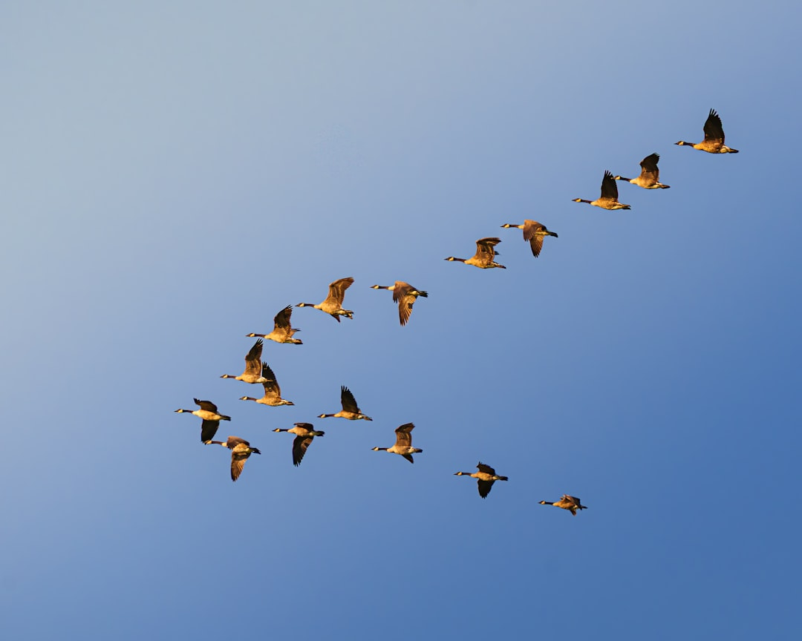           | [Wild Goose Migration](https://en.wikipedia.org/wiki/Goose#Migration)           |
| 15  | Niji hajimete arawaru | First rainbows       | 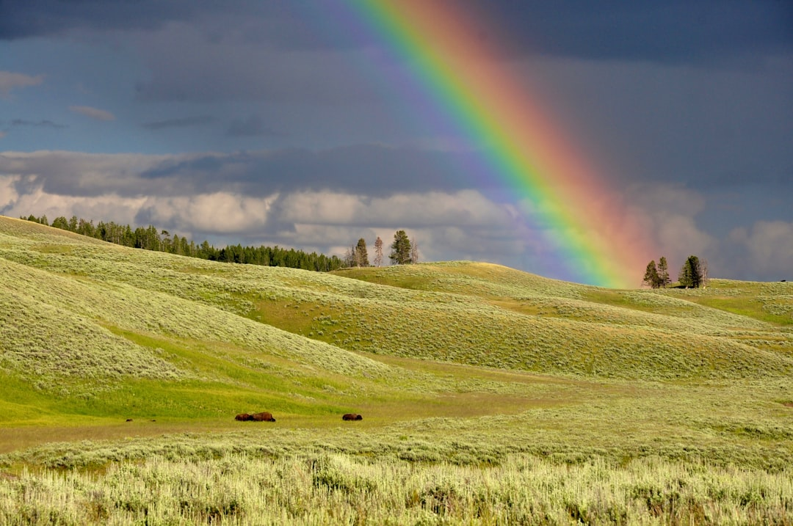 | [How Rainbows Form](https://education.nationalgeographic.org/resource/rainbow/) |

**Sekki Resources:**

- [Qingming Festival](https://en.wikipedia.org/wiki/Qingming_Festival)

---

### 穀雨 Kokuu (Grain Rain) — Apr 20-May 4

| #   | Romaji                 | English                         | Image                                                         | Learn More                                                                                          |
| --- | ---------------------- | ------------------------------- | ------------------------------------------------------------- | --------------------------------------------------------------------------------------------------- |
| 16  | Ashi hajimete shōzu    | First reeds sprout              |     | [Common Reed](https://en.wikipedia.org/wiki/Phragmites)                                             |
| 17  | Shimo yamite nae izuru | Last frost, rice seedlings grow |  | [Rice Cultivation Japan](https://www.japan-guide.com/e/e2059.html)                                  |
| 18  | Botan hana saku        | Peonies bloom                   |         | [Peony in Japanese Culture](https://en.wikipedia.org/wiki/Paeonia_lactiflora#Cultural_significance) |

**Sekki Resources:**

- [Grain Rain - Solar Term](https://en.wikipedia.org/wiki/Grain_Rain)

---

## Summer (May 5 - Aug 7)

### 立夏 Rikka (Beginning of Summer) — May 5-20

| #   | Romaji               | English              | Image                                                       | Learn More                                                                          |
| --- | -------------------- | -------------------- | ----------------------------------------------------------- | ----------------------------------------------------------------------------------- |
| 19  | Kawazu hajimete naku | Frogs start singing  |  | [Japanese Tree Frog](https://en.wikipedia.org/wiki/Japanese_tree_frog)              |
| 20  | Mimizu izuru         | Worms surface        |          | [Earthworm Ecology](https://en.wikipedia.org/wiki/Earthworm)                        |
| 21  | Takenoko shōzu       | Bamboo shoots sprout |        | [Bamboo Shoots in Japanese Cuisine](https://www.nippon.com/en/japan-topics/c15302/) |

**Sekki Resources:**

- [Kodomo no Hi (Children's Day)](https://www.japan-guide.com/e/e2281.html)

---

### 小満 Shōman (Grain Buds) — May 21-Jun 5

| #   | Romaji                   | English                              | Image                                                           | Learn More                                                              |
| --- | ------------------------ | ------------------------------------ | --------------------------------------------------------------- | ----------------------------------------------------------------------- |
| 22  | Kaiko okite kuwa wo hamu | Silkworms start feasting on mulberry |  | [Sericulture in Japan](https://en.wikipedia.org/wiki/Sericulture#Japan) |
| 23  | Benibana sakau           | Safflowers bloom                     | 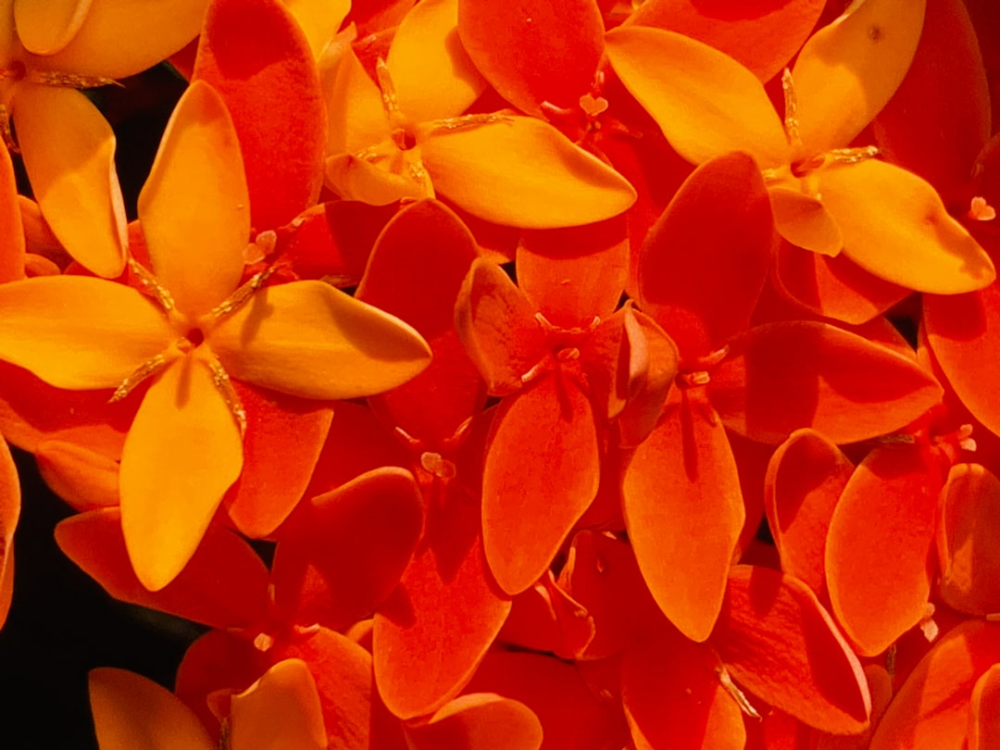           | [Safflower](https://en.wikipedia.org/wiki/Safflower)                    |
| 24  | Mugi no toki itaru       | Wheat ripens and is harvested        |        | [Wheat Harvest](https://en.wikipedia.org/wiki/Wheat#Harvesting)         |

**Sekki Resources:**

- [Grain Buds - Solar Term](<https://en.wikipedia.org/wiki/Grain_Buds_(solar_term)>)

---

### 芒種 Bōshu (Grain in Ear) — Jun 6-20

| #   | Romaji                         | English                        | Image                                                                 | Learn More                                                                                    |
| --- | ------------------------------ | ------------------------------ | --------------------------------------------------------------------- | --------------------------------------------------------------------------------------------- |
| 25  | Kamakiri shōzu                 | Praying mantises hatch         |                  | [Praying Mantis Life Cycle](https://en.wikipedia.org/wiki/Mantis#Reproduction_and_life_cycle) |
| 26  | Kusaretaru kusa hotaru to naru | Rotten grass becomes fireflies |  | [Fireflies in Japan](https://www.japan-guide.com/e/e2302.html)                                |
| 27  | Ume no mi kibamu               | Plums turn yellow              |                | [Umeshu - Plum Wine](https://en.wikipedia.org/wiki/Umeshu)                                    |

**Sekki Resources:**

- [Tsuyu - Rainy Season](https://www.japan-guide.com/e/e2277.html)

---

### 夏至 Geshi (Summer Solstice) — Jun 21-Jul 6

| #   | Romaji               | English             | Image                                                       | Learn More                                                         |
| --- | -------------------- | ------------------- | ----------------------------------------------------------- | ------------------------------------------------------------------ |
| 28  | Natsukarekusa karuru | Self-heal withers   |  | [Self-Heal Plant](https://en.wikipedia.org/wiki/Prunella_vulgaris) |
| 29  | Ayame hana saku      | Irises bloom        |       | [Iris Gardens Japan](https://www.japan-guide.com/e/e2303.html)     |
| 30  | Hange shōzu          | Crow-dipper sprouts |           | [Pinellia ternata](https://en.wikipedia.org/wiki/Pinellia_ternata) |

**Sekki Resources:**

- [Summer Solstice Traditions](https://en.wikipedia.org/wiki/Summer_solstice#Celebrations)

---

### 小暑 Shōsho (Minor Heat) — Jul 7-22

| #   | Romaji                       | English              | Image                                                               | Learn More                                                                                              |
| --- | ---------------------------- | -------------------- | ------------------------------------------------------------------- | ------------------------------------------------------------------------------------------------------- |
| 31  | Atsukaze itaru               | Warm winds blow      |                | [Summer Winds Japan](https://www.jma.go.jp/jma/indexe.html)                                             |
| 32  | Hasu hajimete hiraku         | First lotus blossoms |          | [Lotus in Buddhism](https://en.wikipedia.org/wiki/Nelumbo_nucifera#Cultural_and_religious_significance) |
| 33  | Taka sunawachi waza wo narau | Hawks learn to fly   |  | [Falconry in Japan](https://en.wikipedia.org/wiki/Falconry#Japan)                                       |

**Sekki Resources:**

- [Tanabata Festival](https://www.japan-guide.com/e/e2283.html)

---

### 大暑 Taisho (Major Heat) — Jul 23-Aug 7

| #   | Romaji                       | English                     | Image                                                               | Learn More                                                                     |
| --- | ---------------------------- | --------------------------- | ------------------------------------------------------------------- | ------------------------------------------------------------------------------ |
| 34  | Kiri hajimete hana wo musubu | Paulownia produces seeds    |  | [Paulownia Tree](https://en.wikipedia.org/wiki/Paulownia)                      |
| 35  | Tsuchi uruōte mushi atsushi  | Earth is damp, air is humid |   | [Humidity and Health](https://en.wikipedia.org/wiki/Humid_subtropical_climate) |
| 36  | Taiu tokidoki furu           | Great rains sometimes fall  |            | [Monsoon in Japan](https://en.wikipedia.org/wiki/East_Asian_monsoon)           |

**Sekki Resources:**

- [Doyo no Ushi - Midsummer Day](https://www.japan-guide.com/e/e2062.html)

---

## Autumn (Aug 8 - Nov 6)

### 立秋 Risshū (Beginning of Autumn) — Aug 8-22

| #   | Romaji           | English              | Image                                                   | Learn More                                                                         |
| --- | ---------------- | -------------------- | ------------------------------------------------------- | ---------------------------------------------------------------------------------- |
| 37  | Suzukaze itaru   | Cool winds blow      |    | [Autumn Breeze Poetry](https://en.wikipedia.org/wiki/Autumn#Cultural_associations) |
| 38  | Higurashi naku   | Evening cicadas sing |    | [Evening Cicada](https://en.wikipedia.org/wiki/Tanna_japonensis)                   |
| 39  | Fukaki kiri matō | Dense fog descends   | 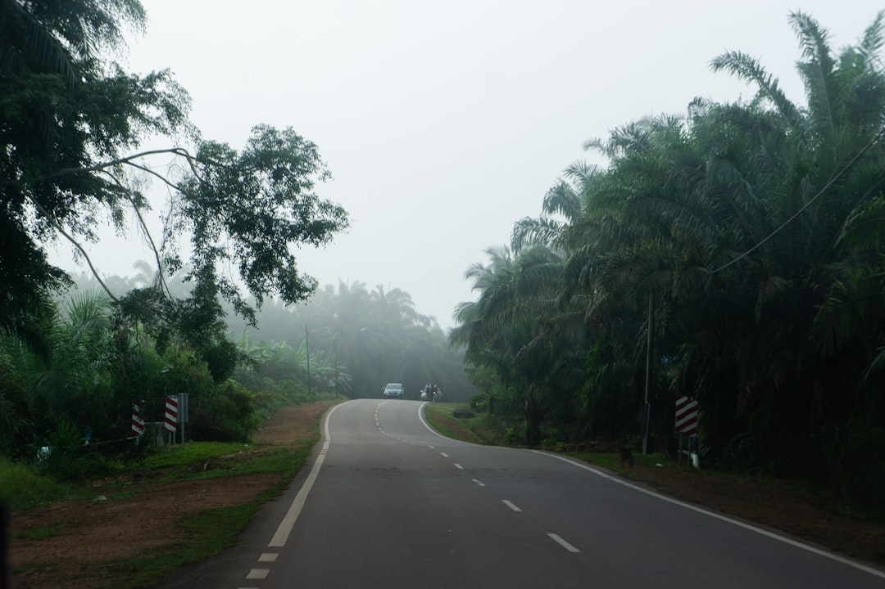 | [Morning Fog Formation](https://en.wikipedia.org/wiki/Fog)                         |

**Sekki Resources:**

- [Obon Festival](https://www.japan-guide.com/e/e2286.html)

---

### 処暑 Shosho (Limit of Heat) — Aug 23-Sep 7

| #   | Romaji                    | English                 | Image                                                            | Learn More                                                      |
| --- | ------------------------- | ----------------------- | ---------------------------------------------------------------- | --------------------------------------------------------------- |
| 40  | Wata no hana shibe hiraku | Cotton flowers bloom    |  | [Cotton Plant](https://en.wikipedia.org/wiki/Gossypium)         |
| 41  | Tenchi hajimete samushi   | Heat starts to die down |    | [End of Summer Japan](https://www.japan-guide.com/e/e2012.html) |
| 42  | Kokumono sunawachi minoru | Rice ripens             |  | [Rice Harvest](https://www.japan-guide.com/e/e2059.html)        |

**Sekki Resources:**

- [Jizobon Festival](https://en.wikipedia.org/wiki/Jiz%C5%8D)

---

### 白露 Hakuro (White Dew) — Sep 8-22

| #   | Romaji                 | English                     | Image                                                         | Learn More                                                                      |
| --- | ---------------------- | --------------------------- | ------------------------------------------------------------- | ------------------------------------------------------------------------------- |
| 43  | Kusa no tsuyu shiroshi | Dew glistens white on grass |  | [Dew Formation](https://en.wikipedia.org/wiki/Dew)                              |
| 44  | Sekirei naku           | Wagtails sing               |            | [Japanese Wagtail](https://en.wikipedia.org/wiki/Japanese_wagtail)              |
| 45  | Tsubame saru           | Swallows leave              |            | [Swallow Migration South](https://en.wikipedia.org/wiki/Barn_swallow#Migration) |

**Sekki Resources:**

- [Tsukimi - Moon Viewing](https://www.japan-guide.com/e/e2062.html)

---

### 秋分 Shūbun (Autumn Equinox) — Sep 23-Oct 7

| #   | Romaji                          | English                    | Image                                                                  | Learn More                                                                    |
| --- | ------------------------------- | -------------------------- | ---------------------------------------------------------------------- | ----------------------------------------------------------------------------- |
| 46  | Kaminari sunawachi koe wo osamu | Thunder ceases             |  | [Autumn Weather Patterns](https://en.wikipedia.org/wiki/Equinox)              |
| 47  | Mushi kakurete to wo fusagu     | Insects hide in the ground |      | [Insect Hibernation](https://en.wikipedia.org/wiki/Hibernation#Invertebrates) |
| 48  | Mizu hajimete karuru            | Farmers drain fields       |             | [Rice Paddy Drainage](https://en.wikipedia.org/wiki/Paddy_field#Draining)     |

**Sekki Resources:**

- [Shūbun no Hi (Equinox Day)](https://www.japan-guide.com/e/e2079.html)
- [Higan - Autumn Observance](https://en.wikipedia.org/wiki/Higan)

---

### 寒露 Kanro (Cold Dew) — Oct 8-22

| #   | Romaji               | English                    | Image                                                       | Learn More                                                                            |
| --- | -------------------- | -------------------------- | ----------------------------------------------------------- | ------------------------------------------------------------------------------------- |
| 49  | Kōgan kitaru         | Wild geese return          |          | [Goose Migration to Japan](https://en.wikipedia.org/wiki/Greater_white-fronted_goose) |
| 50  | Kiku no hana hiraku  | Chrysanthemums bloom       | 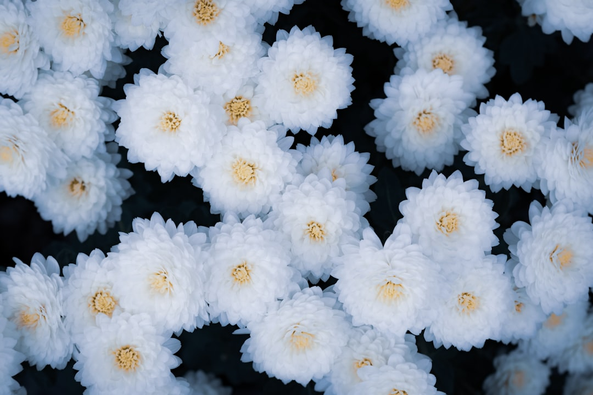  | [Chrysanthemum Festival](https://www.japan-guide.com/e/e2063.html)                    |
| 51  | Kirigirisu to ni ari | Crickets chirp in doorways |  | [Cricket Singing](<https://en.wikipedia.org/wiki/Cricket_(insect)#Chirping>)          |

**Sekki Resources:**

- [Autumn Leaves Japan](https://www.japan-guide.com/e/e2014.html)

---

### 霜降 Sōkō (Frost Falls) — Oct 23-Nov 6

| #   | Romaji               | English                    | Image                                                       | Learn More                                                            |
| --- | -------------------- | -------------------------- | ----------------------------------------------------------- | --------------------------------------------------------------------- |
| 52  | Shimo hajimete furu  | First frost                |   | [Frost Formation](https://en.wikipedia.org/wiki/Frost)                |
| 53  | Kosame tokidoki furu | Light rains sometimes fall | 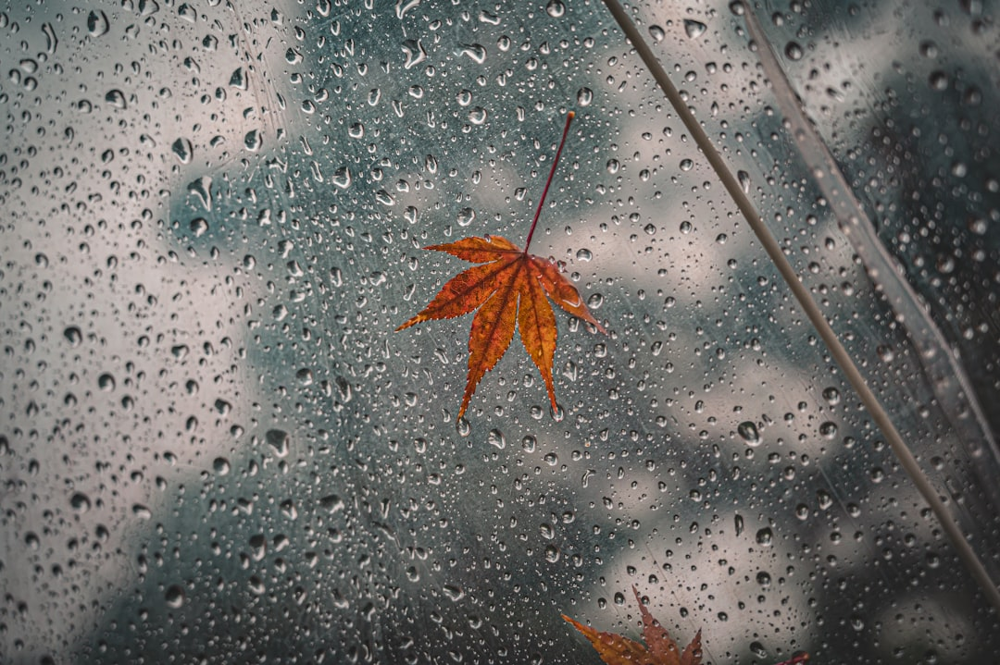 | [Autumn Drizzle](https://en.wikipedia.org/wiki/Drizzle)               |
| 54  | Momiji tsuta kibamu  | Maples and ivy turn yellow |   | [Momijigari - Leaf Viewing](https://www.japan-guide.com/e/e2014.html) |

**Sekki Resources:**

- [Autumn Colors Peak Forecast](https://www.japan-guide.com/e/e2014_when.html)

---

## Winter (Nov 7 - Feb 3)

### 立冬 Rittō (Beginning of Winter) — Nov 7-21

| #   | Romaji                  | English               | Image                                                          | Learn More                                                           |
| --- | ----------------------- | --------------------- | -------------------------------------------------------------- | -------------------------------------------------------------------- |
| 55  | Tsubaki hajimete hiraku | Camellias bloom       |  | [Camellia japonica](https://en.wikipedia.org/wiki/Camellia_japonica) |
| 56  | Chi hajimete kōru       | Land starts to freeze |        | [Ground Frost](https://en.wikipedia.org/wiki/Ground_frost)           |
| 57  | Kinsenka saku           | Daffodils bloom       |            | [Winter Daffodil](<https://en.wikipedia.org/wiki/Narcissus_(plant)>) |

**Sekki Resources:**

- [Shichi-Go-San Festival](https://www.japan-guide.com/e/e2282.html)

---

### 小雪 Shōsetsu (Minor Snow) — Nov 22-Dec 6

| #   | Romaji                    | English                 | Image                                                            | Learn More                                                             |
| --- | ------------------------- | ----------------------- | ---------------------------------------------------------------- | ---------------------------------------------------------------------- |
| 58  | Niji kakurete miezu       | Rainbows hide           | 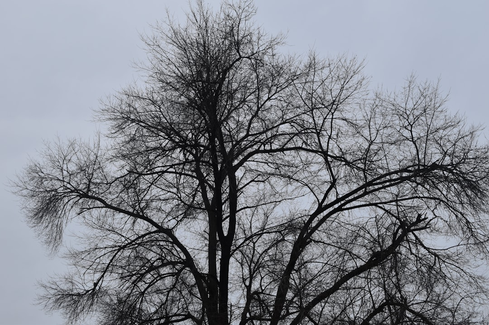       | [Winter Light Angle](https://en.wikipedia.org/wiki/Solar_zenith_angle) |
| 59  | Kitakaze konoha wo harau  | North wind blows leaves |   | [North Wind](https://en.wikipedia.org/wiki/North_wind)                 |
| 60  | Tachibana hajimete kibamu | Tangerines turn yellow  | 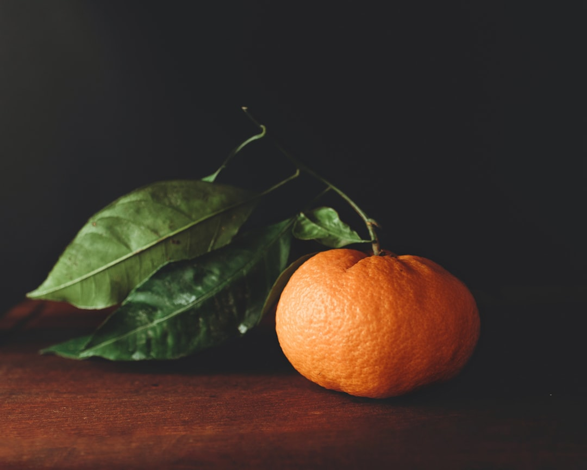 | [Tachibana Orange](https://en.wikipedia.org/wiki/Citrus_tachibana)     |

**Sekki Resources:**

- [Winter in Japan](https://www.japan-guide.com/e/e2012.html)

---

### 大雪 Taisetsu (Major Snow) — Dec 7-21

| #   | Romaji                   | English                         | Image                                                           | Learn More                                                          |
| --- | ------------------------ | ------------------------------- | --------------------------------------------------------------- | ------------------------------------------------------------------- |
| 61  | Sora samuku fuyu to naru | Cold sets in, winter begins     | 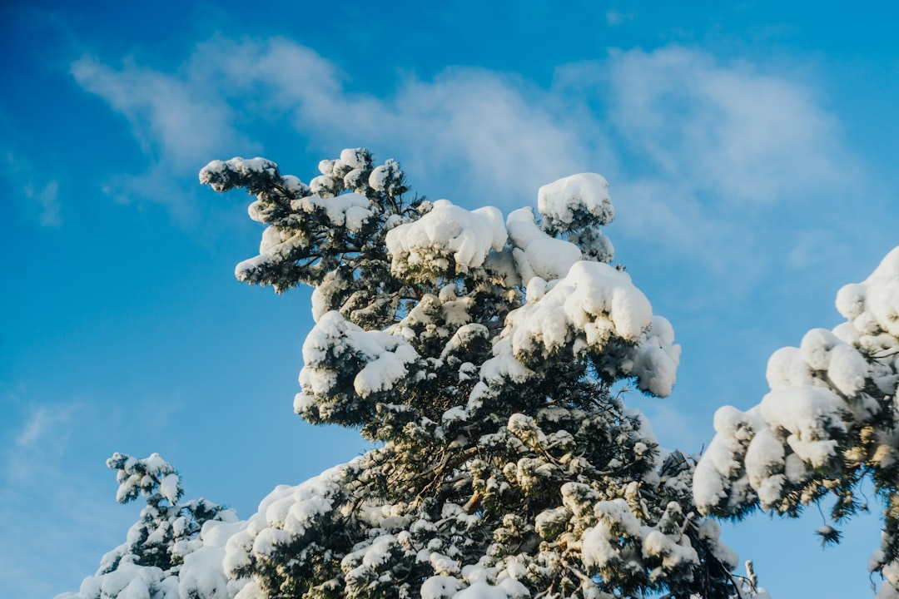 | [Winter Sky Japan](https://en.wikipedia.org/wiki/Winter#Weather)    |
| 62  | Kuma ana ni komoru       | Bears hibernate                 |        | [Bear Hibernation](https://en.wikipedia.org/wiki/Hibernation#Bears) |
| 63  | Sake no uo muragaru      | Salmon gather and swim upstream |       | [Salmon Run Japan](https://en.wikipedia.org/wiki/Salmon_run)        |

**Sekki Resources:**

- [Year-End Traditions](https://www.japan-guide.com/e/e2062.html)

---

### 冬至 Tōji (Winter Solstice) — Dec 22-Jan 4

| #   | Romaji                    | English                  | Image                                                            | Learn More                                                                       |
| --- | ------------------------- | ------------------------ | ---------------------------------------------------------------- | -------------------------------------------------------------------------------- |
| 64  | Natsukarekusa shōzu       | Self-heal sprouts        |        | [Self-Heal Winter Growth](https://en.wikipedia.org/wiki/Prunella_vulgaris)       |
| 65  | Sawashika no tsuno otsuru | Deer shed antlers        | 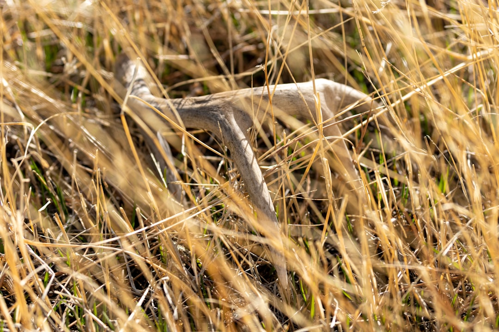 | [Deer Antler Shedding](https://en.wikipedia.org/wiki/Antler#Growth_and_shedding) |
| 66  | Yuki watarite mugi nobiru | Wheat sprouts under snow | 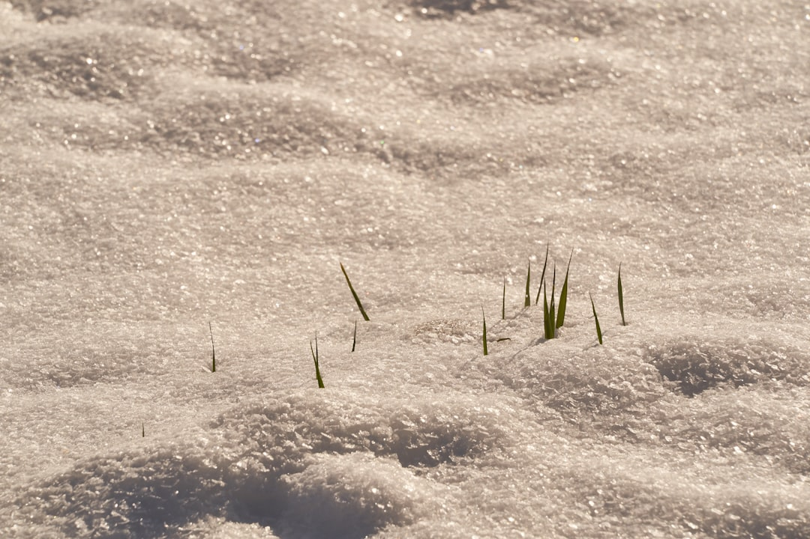 | [Winter Wheat](https://en.wikipedia.org/wiki/Winter_wheat)                       |

**Sekki Resources:**

- [Tōji Traditions - Yuzu Bath](https://www.japan-guide.com/e/e2062.html)
- [Winter Solstice Celebrations](https://en.wikipedia.org/wiki/Winter_solstice#Celebrations)

---

### 小寒 Shōkan (Minor Cold) — Jan 5-19

| #   | Romaji                    | English                 | Image                                                            | Learn More                                                                 |
| --- | ------------------------- | ----------------------- | ---------------------------------------------------------------- | -------------------------------------------------------------------------- |
| 67  | Seri sunawachi sakau      | Parsley flourishes      | 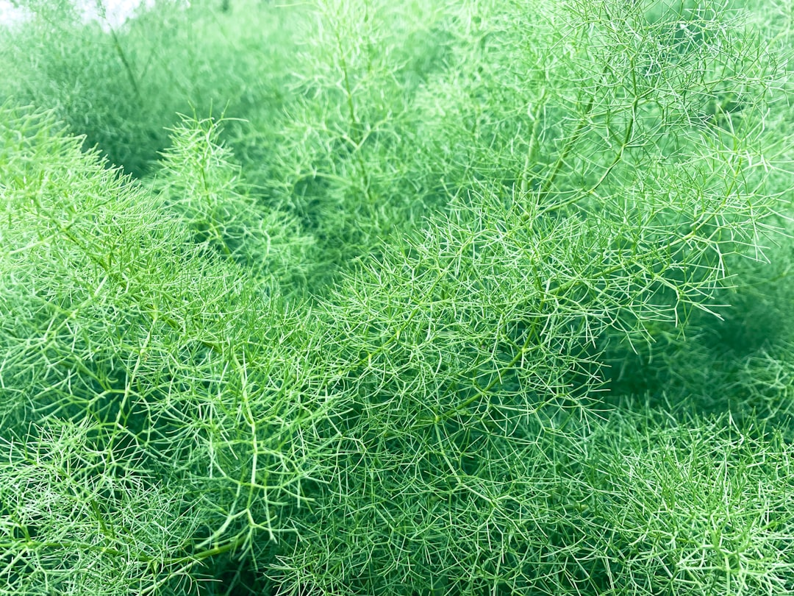      | [Japanese Parsley (Seri)](https://en.wikipedia.org/wiki/Oenanthe_javanica) |
| 68  | Shimizu atataka wo fukumu | Springs thaw            |  | [Natural Springs](<https://en.wikipedia.org/wiki/Spring_(hydrology)>)      |
| 69  | Kiji hajimete naku        | Pheasants start to call |         | [Green Pheasant](https://en.wikipedia.org/wiki/Green_pheasant)             |

**Sekki Resources:**

- [Nanakusa-gayu (Seven Herbs)](https://en.wikipedia.org/wiki/Nanakusa-no-sekku)
- [New Year Traditions](https://www.japan-guide.com/e/e2062.html)

---

### 大寒 Daikan (Major Cold) — Jan 20-Feb 3

| #   | Romaji                          | English                 | Image                                                                  | Learn More                                                                           |
| --- | ------------------------------- | ----------------------- | ---------------------------------------------------------------------- | ------------------------------------------------------------------------------------ |
| 70  | Fuki no hana saku               | Butterburs bud          | 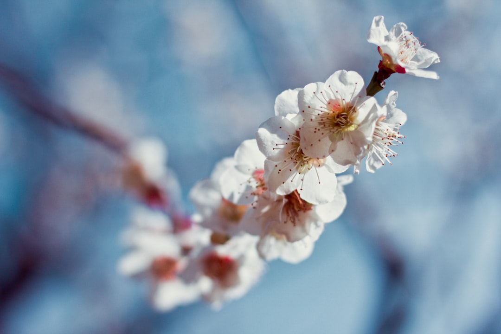               | [Butterbur (Petasites japonicus)](https://en.wikipedia.org/wiki/Petasites_japonicus) |
| 71  | Sawamizu kōri tsumeru           | Ice thickens on streams |            | [Ice Formation on Streams](https://en.wikipedia.org/wiki/Ice)                        |
| 72  | Niwatori hajimete toya ni tsuku | Hens start laying       |  | [Chicken Egg Laying Cycles](https://en.wikipedia.org/wiki/Egg_laying#Chickens)       |

**Sekki Resources:**

- [Daikan - Coldest Period](https://www.nippon.com/en/features/h00124/)
- [Setsubun (End of Winter)](https://www.japan-guide.com/e/e2062.html)

---

## Philosophical Resources by Theme

### Patience & Hidden Growth (Winter/Early Spring)

- [Wabi-Sabi - Leonard Koren](https://www.amazon.com/Wabi-Sabi-Artists-Designers-Poets-Philosophers/dp/0981484603)
- [In Praise of Shadows - Tanizaki](https://tuttlepublishing.com/japan/in-praise-of-shadows-and-other-essays-9784805319352)

### Emergence & Receptivity (Spring)

- [Braiding Sweetgrass - Robin Wall Kimmerer](https://milkweed.org/book/braiding-sweetgrass)
- [The Book of Tea - Okakura (Gutenberg)](https://www.gutenberg.org/ebooks/769)

### Energy & Production (Summer)

- [Deep Work - Cal Newport](https://www.calnewport.com/books/deep-work/)
- [Four Thousand Weeks - Oliver Burkeman](https://www.oliverburkeman.com/fourthousandweeks)

### Harvest & Release (Autumn)

- [How to Do Nothing - Jenny Odell](https://www.penguinrandomhouse.com/books/600671/how-to-do-nothing-by-jenny-odell/)
- [Meditations - Marcus Aurelius (Gutenberg)](https://www.gutenberg.org/ebooks/2680)

### Rest & Conservation (Winter)

- [Rest - Alex Soojung-Kim Pang](https://www.hachettebookgroup.com/titles/alex-soojung-kim-pang/rest/9781541604834/)
- [Zen Mind, Beginner's Mind - Shunryu Suzuki](https://www.penguinrandomhouse.com/books/175559/zen-mind-beginners-mind-by-shunryu-suzuki/)
