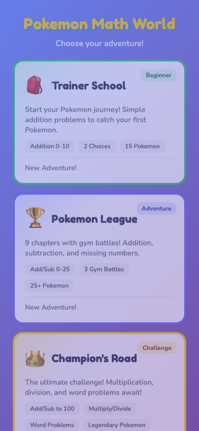
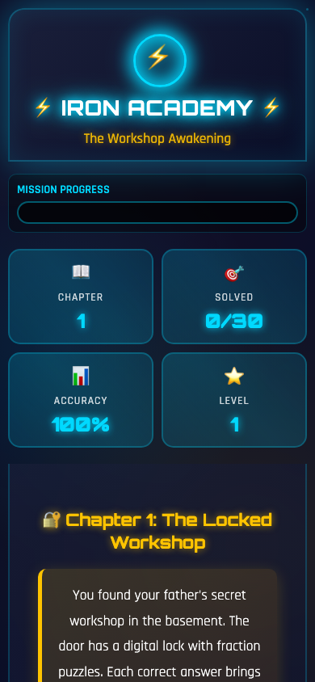
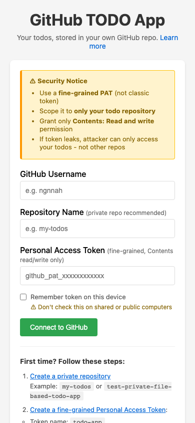

# Mini-Projects

Interactive web apps built with AI assistance, deployed to GitHub Pages.

**Live Site:** https://ngnnah.github.io/I-And-AI/

## Apps

### Pokemon Math World

A progressive math learning game with Pokemon theme. Three difficulty levels take players from simple addition through multiplication, division, and word problems.

| Level           | Topics                                          | Target             |
| --------------- | ----------------------------------------------- | ------------------ |
| Trainer School  | Addition 0-10                                   | Grade 1 beginner   |
| Pokemon League  | Add/sub 0-25, missing numbers                   | Grade 1-2          |
| Champion's Road | Add/sub to 100, multiply, divide, word problems | Grade 1-2 advanced |

**Features:**

- 40+ Pokemon to catch
- Chapter selection with icons and Pokemon sprites
- Battle system with back navigation
- Per-question progress saving
- Sound effects and animations



---

### Iron Academy

Math learning game for Grade 5-6 students with Tony Stark / Iron Man theme.

**Features:**

- Feynman-style explanations for wrong answers
- SAT vocabulary builder
- 3 attempts per question with hints
- Progress saving with localStorage
- 6 chapters covering pre-algebra concepts



---

### GitHub TODO App

A client-side TODO application that uses GitHub as a backend via the GitHub API.

**Features:**

- No server required - runs entirely in browser
- Tasks stored in a private GitHub repo
- GitHub OAuth authentication
- Create, complete, and delete tasks



---

## Deployment Architecture

```
projects/           <- Source code (development)
    pokemon-math-world/
    iron-academy/
    github-todo-app/

public/             <- Deployed files (GitHub Pages serves from here)
    index.html      <- Landing page
    projects/       <- Copies of project files
        pokemon-math-world/
        iron-academy/
        github-todo-app/
```

### How It Works

1. **Development**: Edit files in `projects/<app-name>/`
2. **Sync**: Copy updated files to `public/projects/<app-name>/`
3. **Commit & Push**: Git push to `main` branch
4. **Deploy**: GitHub Pages automatically serves from `public/` directory

### Why This Structure?

- **Separation of concerns**: Source in `projects/`, deployed in `public/`
- **No build step**: Plain HTML/JS/CSS works directly on GitHub Pages
- **ES Modules**: Modern JavaScript modules work with `<script type="module">`
- **Simple CI/CD**: Push to main = instant deployment

### Tech Stack

All apps use:

- **Vanilla JavaScript** - No frameworks, just ES modules
- **CSS3** - Animations, gradients, responsive design
- **localStorage** - Client-side persistence
- **GitHub Pages** - Free static hosting

## Adding a New Project

1. Create folder: `projects/new-app/`
2. Add `index.html` and supporting files
3. Copy to `public/projects/new-app/`
4. Update `public/index.html` landing page
5. Commit and push

## Screenshots

All app screenshots are stored in `resources/screenshots/` with naming convention:

```
YYYYMMDD-HHMMSS_app-name_description.png
```
