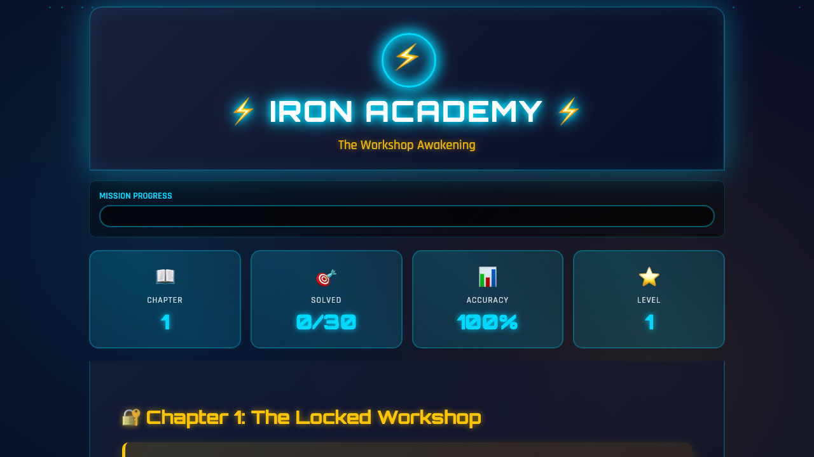

# Iron Academy: The Workshop Awakening

A Tony Stark / Iron Man themed math game for 5th-6th graders. Learn fractions, decimals, percentages, and order of operations through an engaging story of unlocking a secret workshop.

**Live Demo**: https://ngnnah.github.io/I-And-AI/projects/iron-academy/

## Features

- **5 Chapters** with progressive difficulty and storyline
- **30 Math Problems** covering Grade 5-6 curriculum
- **SAT Vocabulary Builder** - 12 clickable words with definitions, examples, and memory tricks
- **Feynman Explanations** - Each problem includes "What You Did", "Why It Works", "Real World Application", and "Fun Facts"
- **Multiple Attempts** - 3 tries per problem with auto-hints on first wrong answer
- **Scoring System** - Bonus points for first try, speed (<30s), and streaks
- **Sound Effects** - Web Audio API beeps for correct/incorrect/level-up
- **Mobile Friendly** - PWA-ready with iOS Safari optimizations
- **Easter Eggs** - Konami code bonus (+500 points)

## Math Topics by Chapter

| Chapter | Title                   | Topics                             |
| ------- | ----------------------- | ---------------------------------- |
| 1       | The Locked Workshop     | Fraction addition & subtraction    |
| 2       | The Blueprint Challenge | Fraction multiplication & division |
| 3       | The Decimal Computer    | Decimal-fraction conversion        |
| 4       | The Percentage Puzzle   | Percentage calculations            |
| 5       | The Order of Operations | PEMDAS mastery                     |

## How Progress is Saved

All game progress is saved to **browser localStorage** automatically. No account or server needed.

**What's saved:**

| Data                | Description                        |
| ------------------- | ---------------------------------- |
| `currentChapter`    | Current chapter progress           |
| `score`             | Total points earned                |
| `totalAttempts`     | Number of answer submissions       |
| `correctAnswers`    | Correct answer count               |
| `hintsUsed`         | Number of hints used               |
| `maxStreak`         | Best consecutive correct answers   |
| `fastSolves`        | Problems solved under 30 seconds   |
| `totalTime`         | Total time spent solving           |
| `completedChapters` | Array of completed chapter indices |

**Storage key:** `iron-academy-save`

**Note**: Progress is per-browser and per-device. Clearing browser data will reset the game. Game save clears after completing all chapters (to allow fresh replays).

## SAT Vocabulary Words

The game teaches 12 vocabulary words with interactive tooltips:

- **denominator** / **numerator** / **reciprocal** / **simplify**
- **convert** / **percentage** / **PEMDAS** / **parentheses**
- **alloy** / **precision** / **trajectory** / **sequence**

Each word includes: definition, example, and a memory trick to help retention.

## Tech Stack

- **Single HTML file** (~2400 lines) - no build process, just open and play
- **Vanilla JavaScript** - no frameworks
- **CSS3** - advanced animations, gradients, responsive design
- **localStorage API** - persistent game state
- **Web Audio API** - sound effects
- **PWA Manifest** - installable on mobile devices
- **Google Fonts** - Orbitron (titles), Rajdhani (body)

## Tools Used

- **Claude Code** - AI pair programming for rapid development
- **GitHub Pages** - Free hosting with CI/CD

## Screenshots

_Chapter 1 start screen with Iron Man themed UI, arc reactor logo, and stats dashboard_

## Related

- [Pokemon Math (Beginner)](../pokemon-math/) - Simple addition for 1st graders
- [Pokemon Math Adventure](../pokemon-math-advanced/) - 9 chapters for 1st-2nd graders

## Credits

- Iron Man and Tony Stark are trademarks of Marvel/Disney
- Built for educational purposes only
